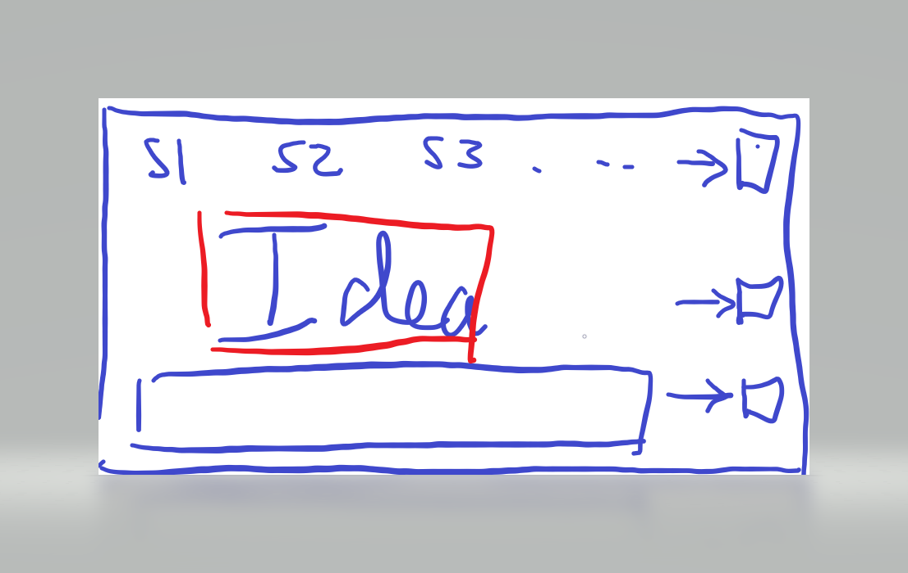
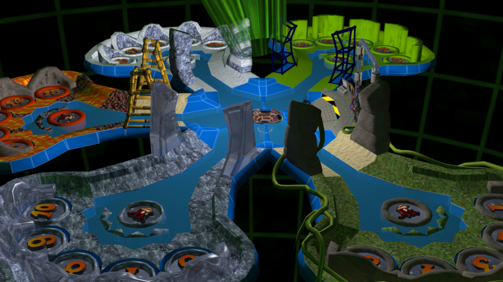
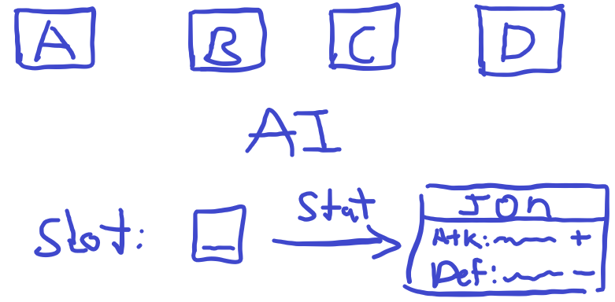
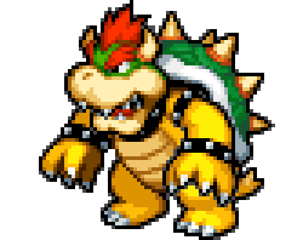
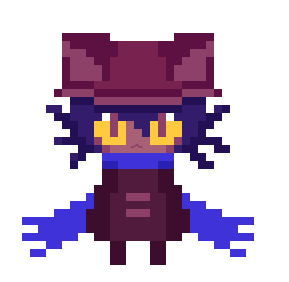
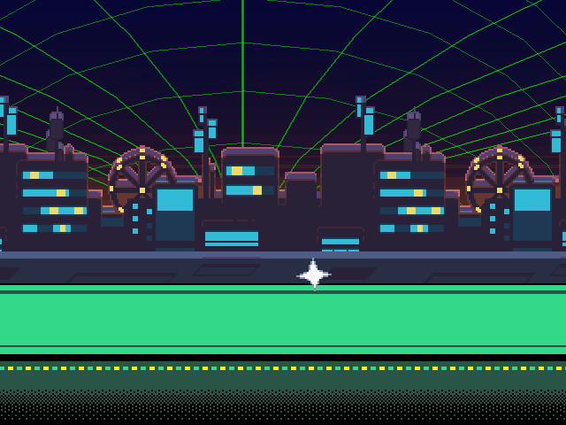
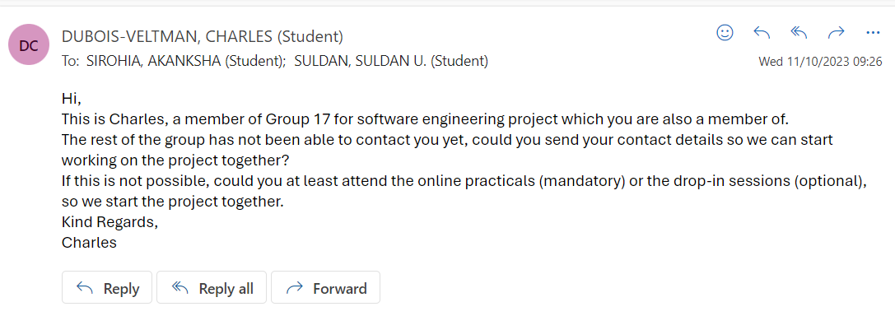
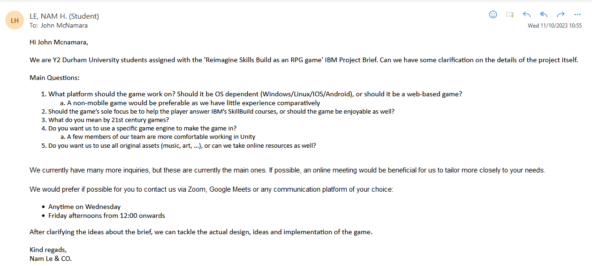
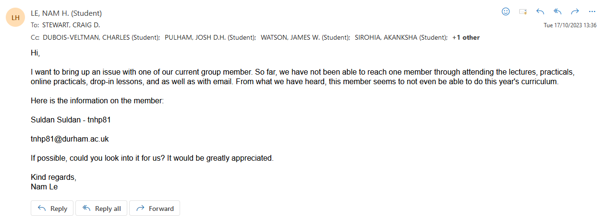
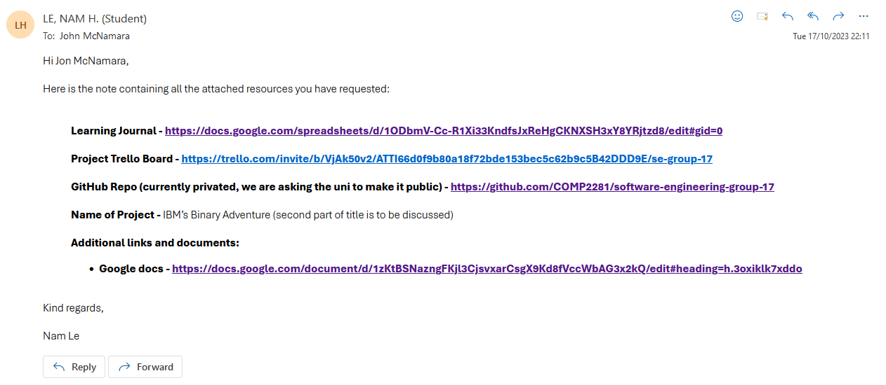

# RPG Game

## Table of Contents

- [RPG Game](#rpg-game)
  - [Table of Contents](#table-of-contents)
  - [Proposed Titles](#proposed-titles)
  - [Questions to ask client](#questions-to-ask-client)
  - [Minutes](#minutes)
    - [Week 1 Minutes](#week-1-minutes)
    - [Week 2 Minutes](#week-2-minutes)
  - [Problems](#problems)
  - [SOP - RAG Sheet](#sop---rag-sheet)
  - [Ideas](#ideas)
    - [Inspiration - Undertale / Deltarune](#inspiration---undertale--deltarune)
    - [Learning Game with Rewards](#learning-game-with-rewards)
    - [Top Down Puzzle RPG](#top-down-puzzle-rpg)
  - [Communication](#communication)
    - [What we learnt from Online Meeting:](#what-we-learnt-from-online-meeting)
    - [Learning Journal](#learning-journal)

## Proposed Titles

- IBM's Binary Adventure
- That time I was transported to a digital world and became the best IBM Skill Build user
- Ascending the IBM tower of Skill Build mastery
- IBM's blessing on this wonderful digital world
- How to pick up badges in a digital world

[Go back up](#table-of-contents)
## Questions to ask client

1. What platform should the game work on? (OS dependent? Windows/Linux/IOS/Android/Web-based?)
2. How in-depth should the resources linked in the game go into? (If an end user can get the badges in the IBM courses, should they be made to play the game fully, or can they answer the question and quickly get through it?) - Should the game’s sole focus be to help the player answer IBM’s SkillBuild courses, or should the game be enjoyable as well?
   - We should totally make a resource system where things are limited, forcing the player to make choices
3. What controls should the game use? (Touch input? Controller support? Keyboard?)
4. What is the age range of our target audience? - College student
5. Should the game only be for people with no knowledge of IBM skills?
6. Should the game be aimed at people with little or lots of knowledge of RPGs?
7. What do you mean by 21st century games?
8. Do you want us to use a specific game engine to make the game in?
   1. Say we prefer Unity or RPGMaker
9. Do you want us to use all original assets, or can we take online resources as well?
   1. Royalty free?
10. What system requirements are recommended for the game to run on? -
11. Genre?
12. Art style?
13. Clarify what specific skills build sections we should be going over
14. Should the game be an aid to the course or a course replacement?
15. Can we add John into the game? - Yes
16. Where to find the documentation? - Find the downloads of pdfs and stuff on each course

[Go back up](#table-of-contents)
## Minutes

### Week 1 Minutes

- Creation of main document
- Made list of questions to ask clients
- Came up with some inital project ideas
- Sent email to IBM asking for a meeting
- Sent email to all members asking for a communication
- Initial look through the IBM SkillsBuild website for information on topics we need to add to the game
- Goal for the week
  - Read through the documentation of IBM SkillsBuild
  - Make RAG Sheet

### Week 2 Minutes

- Last Week's Goals: Achieved
- Introduction to project manager
- Finalisation of project idea
- Meeting with IBM client
- Goal for the week:
  - Get all IBM SkillBuild badges on green marked courses on our RAG sheet by Friday 27th

[Go back up](#table-of-contents)
## Problems 

- Puzzles vs Combat - which one should be central
- How to integrate learning into combat
- Who's doing art...
- Music?

[Go back up](#table-of-contents)
## SOP - RAG Sheet 

1. Go through pathway to learning, review all the checkmarked skills and add the relevant ones to the RAG spreadsheet
   1. Green - project
   2. Amber - course / career
   3. Red - not relevant
2. Review a Skills Build learning activity that is green on the RAG sheet, get the badge for it and add the following to learning journal
   1. Week of the project
   2. Title of learning skill reviewed
   3. A link to the page
   4. A paragraph about what you learnt

[Go back up](#table-of-contents)
## Ideas 

### Inspiration - Undertale / Deltarune

- The player is an IBM employee and gets transported to a world in his computer
- Everything from his job appears in the world
- His computer is corrupted and needs fixing (he also wants to go back home)
- Make a top down 2D rpg
- Doors block the way forward, players must answer questions to proceed
- Players can find answers to questions through combat and puzzles
- Combat will have the option to “scan enemies” for information to get clues on how to answer questions
- Have puzzles where the layout is basically trying to mix and match items. Can also include Q&A

### Learning Game with Rewards

- The player answers various questions to gain points
- These points can then be traded to play minigames

### Top Down Puzzle RPG

- The player is an IBM employee and gets transported to a world in his computer
- Everything from his job appears in the world
- His computer has a virus and needs to be fixed in order for the employee to go back
- Doors block the way forward, players must answer questions to proceed
  - In order to answer these questions players must find the right answer through puzzles
- Bosses will exist between some puzzles
  - Bosses will be difficult and involve answering questions to damage the boss and avoiding damage by answering questions in quick time events
- Intro scene
  - IBM John welcome you to your new job at IBM SkillsBuild
    - What is John going to wear? Suit, hoodie, shirt, tshirt, jeans, suit, trousers?
  - Ask who you are: Choose a character (similar to pokemon)
  - Then you end up in your room working on your computer

- Thinking face

- What is John going to wear? Suit, hoodie, shirt, tshirt, jeans, suit trousers?

- Wrath of Cortex style hub world (see image above)
- Magical Macguffin- Magical object that drives plot forward, for example, the holy grail, the triforce, pandora's box
  - Quint-force - inspired by tri-force, object made of 5 pieces, required to either defeat final boss or access final area
  - Master Sword style weapon - used to destroy final boss, or create a rip in the world they are transported to, allowing main character to escape
  - Magical macguffin can work with a skill tree
- Pixel art characters - black borders in real world, purple borders in virtual world (No Game No Life style)
- Each area (world) will have its own distinct style
  - Cloud - Sky Islands
  - Journey to cloud - Victory road style
  - AI - Cyberpunk/Synthwave City
  - Data Science - Very Tedious Dungeon, Warehouse
  - Threat Intelligence - Volcano?
  - Final Area - Wireframe/virtual world falling apart. Mainframe?
  - Final boss is a recap of everything
- Puzzle ideas:
  - Conveyor Belt puzzle
  - Puzzle where you control 2 characters at once and move them to hit buttons
  - Teleports
  - Parts Builder AI
  - Pokemon gym puzzles
  - Baba is you
  - Square thing where you move blocks around to make an image
- Skills Build Tree
  - Magical Macguffin from boss: can slot into skills build tree, player chooses what bonus they want

  - AI
    - Health
    - Defense
    - Dodge Chance
  - Threat Intelligence
    - Attack
    - Armour Piercing
    - Lifesteal
  - Data Science
    - Could do joint skill trees like AI/Threat Intelligence and Cloud/Data Science, allowing for 3 options in each, of which by the end you have chosen 2 of 3
  - Cloud
- Overivew of what needs to be done for the game:
  1. Main menu
      -  New game
      - Continue
      - Settings
      - Controls
      - Credits
      - Exit
  2. Pause Menu
      - Continue
      - Controls
      - Exit
  3. Intro cutscene with john
      - Character selection
  4. Cutscene where you get sucked into the computer
  5. Hub World
  6. Creation of other worlds with specific puzzles
  7. Interactable objects for documentation
  8. Combat system 
  9. Skill tree
  10. Item collection / inventory
  11. Final Boss
  12. Final cutscene

[Go back up](#table-of-contents)
## Communication

### What we learnt from Online Meeting:

- Age group: Secondary, Uni
- Not violent / inappropriate
- Game which allows pause
- Puzzle / Q&A
- CAPSTONE badges should be used for questions
- Needs to have saving feature
- Sprite of John needs to be in the game

### [Learning Journal](https://docs.google.com/spreadsheets/d/1IZtANq7ruhhZvN3znZopCmB7hLXw76JRNAhnZD1jfeE/edit?usp=sharing)

[Go back up](#table-of-contents)