# RPG Game

## Table of Contents

- [RPG Game](#rpg-game)
  - [Table of Contents](#table-of-contents)
  - [Proposed Titles](#proposed-titles)
  - [Questions and Answers to client](#questions-and-answers-to-client)
    - [Answers to questions](#answers-to-questions)
  - [Minutes](#minutes)
    - [Week 1 Minutes](#week-1-minutes)
    - [Week 2 Minutes](#week-2-minutes)
  - [SOP - RAG Sheet](#sop---rag-sheet)
  - [Ideas](#ideas)
    - [Inspiration - Undertale / Deltarune](#inspiration---undertale--deltarune)
    - [Learning Game with Rewards](#learning-game-with-rewards)
    - [Top Down Puzzle RPG](#top-down-puzzle-rpg)
  - [Overview of what needs to be done for the game:](#overview-of-what-needs-to-be-done-for-the-game)
  - [Communication](#communication)
    - [What we learnt from Online Meeting (18/10/2023):](#what-we-learnt-from-online-meeting-18102023)
  - [Learning Journal](#learning-journal)

## Proposed Titles

- IBM's Binary Adventure
- That time I was transported to a digital world and became the best IBM Skill Build user
- Ascending the IBM tower of Skill Build mastery
- IBM's blessing on this wonderful digital world
- How to pick up badges in a digital world

[Go back up](#table-of-contents)
## Questions and Answers to client

1. ~~What platform should the game work on? (OS dependent? Windows/Linux/IOS/Android/Web-based?)~~
2. ~~How in-depth should the resources linked in the game go into? (If an end user can get the badges in the IBM courses, should they be made to play the game fully, or can they answer the question and quickly get through it?) - Should the game’s sole focus be to help the player answer IBM’s SkillBuild courses, or should the game be enjoyable as well?~~
   - ~~We should totally make a resource system where things are limited, forcing the player to make choices~~
3. What controls should the game use? (Touch input? Controller support? Keyboard?)
4. ~~What is the age range of our target audience?~~
5. Should the game only be for people with no knowledge of IBM skills?
6. Should the game be aimed at people with little or lots of knowledge of RPGs?
7. ~~What do you mean by 21st century games?~~
8. ~~Do you want us to use a specific game engine to make the game in?~~
   - ~~Say we prefer Unity or RPGMaker~~
9.  ~~Do you want us to use all original assets, or can we take online resources as well?~~
   - ~~Royalty free?~~
10. What system requirements are recommended for the game to run on?
11. ~~Genre?~~
12. ~~Art style?~~
13. ~~Clarify what specific skills build sections we should be going over~~
14. ~~Should the game be an aid to the course or a course replacement?~~
15. ~~Can we add John into the game?~~
16. Where to find the documentation?

### Answers to questions
1. Windows
2. Resources can be accessed directly on SkillBuild, and thus will not need to be implemented in the game. Only the questions needs to be in. The game ideally should be fun and help learn.
   - Idea scrapped   
3. N/A
4. Secondary school and University students
5. N/A
6. N/A
7. Something fun and engaging
8. Unity if we have a license for it
9. Online resources are fine as long as they are free
10. N/A
11. RPG, any genre is fine
12. Any art style is fine
13. Capstone is recommended. Aside from that, any green coloured courses on RAG sheet
14. Aid to course
15. Yes
16. N/A

[Go back up](#table-of-contents)
## Minutes

### Week 1 Minutes

- Creation of main document
- Made list of questions to ask clients
- Came up with some inital project ideas
- Sent email to IBM asking for a meeting
- Sent email to all members asking for a communication
- Initial look through the IBM SkillsBuild website for information on topics we need to add to the game
- Goal for the week
  - Read through the documentation of IBM SkillsBuild
  - Make RAG Sheet

### Week 2 Minutes

- **Last Week's Goals**: Achieved
- **Bottlenecks**: None
- Introduction to project manager
- Finalisation of project idea
- Meeting with IBM client
- Goal for the week:
  - Get all IBM SkillBuild badges on green marked courses on our RAG sheet by Friday 27th

[Go back up](#table-of-contents)
## SOP - RAG Sheet 

1. Go through pathway to learning, review all the checkmarked skills and add the relevant ones to the RAG spreadsheet
   1. Green - project
   2. Amber - course / career
   3. Red - not relevant
2. Review a Skills Build learning activity that is green on the RAG sheet, get the badge for it and add the following to learning journal
   1. Week of the project
   2. Title of learning skill reviewed
   3. A link to the page
   4. A paragraph about what you learnt

[Go back up](#table-of-contents)
## Ideas 

### Inspiration - Undertale / Deltarune

- The player is an IBM employee and gets transported to a world in his computer
- Everything from his job appears in the world
- His computer is corrupted and needs fixing (he also wants to go back home)
- Make a top down 2D rpg
- Doors block the way forward, players must answer questions to proceed
- Players can find answers to questions through combat and puzzles
- Combat will have the option to “scan enemies” for information to get clues on how to answer questions
- Have puzzles where the layout is basically trying to mix and match items. Can also include Q&A

### Learning Game with Rewards

- The player answers various questions to gain points
- These points can then be traded to play minigames

### Top Down Puzzle RPG

- The player is an IBM employee and gets transported to a world in his computer
- Everything from his job appears in the world
- His computer has a virus and needs to be fixed in order for the employee to go back
- Doors block the way forward, players must answer questions to proceed
  - In order to answer these questions players must find the right answer through puzzles
- Bosses will exist between some puzzles
  - Bosses will be difficult and involve answering questions to damage the boss and avoiding damage by answering questions in quick time events
- Intro scene
  - IBM John welcome you to your new job at IBM SkillsBuild
    - What is John going to wear? Suit, hoodie, shirt, tshirt, jeans, suit, trousers?
  - Ask who you are: Choose a character (similar to pokemon)
  - Then you end up in your room working on your computer

- Thinking face

- What is John going to wear? Suit, hoodie, shirt, tshirt, jeans, suit trousers?

- Wrath of Cortex style hub world (see image above)
- Magical Macguffin- Magical object that drives plot forward, for example, the holy grail, the triforce, pandora's box
  - Quint-force - inspired by tri-force, object made of 5 pieces, required to either defeat final boss or access final area
  - Master Sword style weapon - used to destroy final boss, or create a rip in the world they are transported to, allowing main character to escape
  - Magical macguffin can work with a skill tree
- Pixel art characters - black borders in real world, purple borders in virtual world (No Game No Life style)
- Each area (world) will have its own distinct style
  - Cloud - Sky Islands
  - Journey to cloud - Victory road style
  - AI - Cyberpunk/Synthwave City
  - Data Science - Very Tedious Dungeon, Warehouse
  - Threat Intelligence - Volcano?
  - Final Area - Wireframe/virtual world falling apart. Mainframe?
  - Final boss is a recap of everything
- Puzzle ideas:
  - Conveyor Belt puzzle
  - Puzzle where you control 2 characters at once and move them to hit buttons
  - Teleports
  - Parts Builder AI
  - Pokemon gym puzzles
  - Baba is you
  - Square thing where you move blocks around to make an image
- Skills Build Tree
  - Magical Macguffin from boss: can slot into skills build tree, player chooses what bonus they want

  - AI
    - Health
    - Defense
    - Dodge Chance
  - Threat Intelligence
    - Attack
    - Armour Piercing
    - Lifesteal
  - Data Science
    - Could do joint skill trees like AI/Threat Intelligence and Cloud/Data Science, allowing for 3 options in each, of which by the end you have chosen 2 of 3
  - Cloud

### Free Art Asset Collection
This section mostly consistes of free assets found on itch.io that are free for game developers to use
#### Music
[Music Loop Bundle](https://tallbeard.itch.io/music-loop-bundle)

[Short Loopable Music FIles](https://joshuuu.itch.io/short-loopable-background-music)

#### Sound Effects
[Sound Effect Collection 1](https://jdwasabi.itch.io/8-bit-16-bit-sound-effects-pack)

[Dungeon Audio Pack](https://leohpaz.itch.io/minifantasy-dungeon-sfx-pack)

[Massive Sound Effect Library](https://filmcow.itch.io/filmcow-sfx)

[Dialouge Pack](https://dillonbecker.itch.io/sdap)

#### Backgrounds
[Cyberpunk City Environments](https://ansimuz.itch.io/cyberpunk-street-environment)

[Sunset Mountain Parallax](https://ansimuz.itch.io/mountain-dusk-parallax-background)

[Space Generator](https://deep-fold.itch.io/space-background-generator)

[Seamless Space Backgrounds](https://screamingbrainstudios.itch.io/seamless-space-backgrounds)

#### Textures and Assets
[Ninja Adventure - Autumnal Asset Pack](https://pixel-boy.itch.io/ninja-adventure-asset-pack)

[Dungeon Asset Pack](https://pixel-poem.itch.io/dungeon-assetpuck)

[Temple Asset Pack](https://cainos.itch.io/pixel-art-top-down-basic)

[Forest Tileset](https://pixivan.itch.io/top-down-forest-tileset)

[House Assets](https://penzilla.itch.io/top-down-retro-house)

[Realistic Low Res Texture Pack](https://screamingbrainstudios.itch.io/tiny-texture-pack-2)

[Another Forest Asset Pack](https://seliel-the-shaper.itch.io/gentle-forest)

[Cloud City Asset Pack](https://finalbossblues.itch.io/cloud-city-tileset)

[Material Assets](https://beast-pixels.itch.io/crafting-materials)

[Simple Texture Pack](https://piiixl.itch.io/textures)

[Another Pixel Texture Pack](https://jestan.itch.io/pixel-texture-pack)

[RPG Marketplace Pack](https://gif-superretroworld.itch.io/marketplace)

[Cozy Pixel Asset Pack](https://limezu.itch.io/serenevillagerevamped)

[Massive Modern Interiors Asset Pack](https://limezu.itch.io/moderninteriors)

#### Other Assets
[GUI Asset Pack](https://crusenho.itch.io/complete-gui-essential-pack)

[More Pixel Art GUI Elements](https://mounirtohami.itch.io/pixel-art-gui-elements)

[Food](https://ghostpixxells.itch.io/pixelfood)

[Pixel Font](https://poppyworks.itch.io/silver)

[Health and Scroll Bars](https://bdragon1727.itch.io/basic-pixel-health-bar-and-scroll-bar)

[Skill Icons](https://pixerelia.itch.io/vas-basic-spells-and-buffs)

[Another Pixel Font](https://tinyworlds.itch.io/free-pixel-font-thaleah)

[Dynamic Font Tags](https://wattson.itch.io/kinetic-text-tags)

[Glitch Effect](https://odditica.itch.io/bktglitch)

### Market Research

Before we can begin with new asset creation, we need to finalise some of the more in depth points about world traversal and combat.
#### Battle Style
RPG combat has incredible variation, and there is far from one set presentation or style that must be followed for a game to be classed as an RPG, thus we need to decide on what format we want our Q&A combat to be in, firstly in how we want our player and our enemies to be represented in battle.
##### Style 1 -  Undertale
One of the first RPGs that come to mind when we consider combat encounters that allow you to talk to your enemies is the 2015 game Undertale, which does not feature the player character, and has a front shot of the enemy you are fighting or talking to.

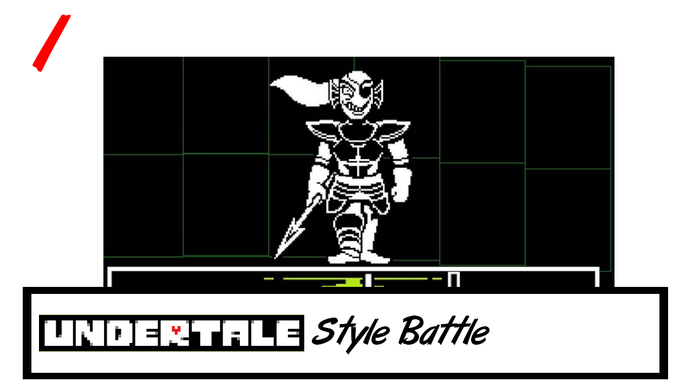

##### Style 2 - Final Fantasy 6
Alongside the likes of Dragon Quest, the Final Fantasy series is one of the forefathers of the RPG genre; Final Fantasy 6 is the last purely 2D mainline Final Fantasy game, the game features combat where players and enemies face each other from opposite sides of the screen, with sprites that show their full bodies.

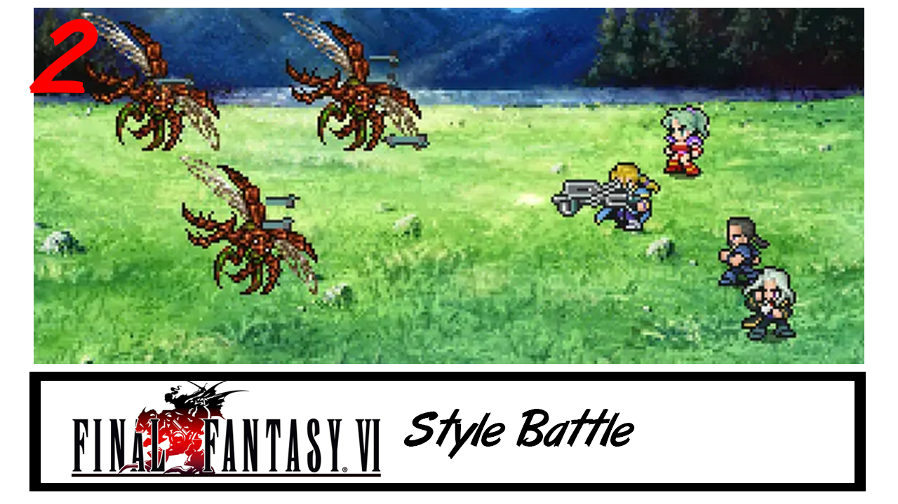

##### Style 3 - Pokemon
As one of the biggest franchises on the planet, the original Pokemon games have captivated many people over the years, featuring two characters facing off on opposite corners, both with a 3/4 perspective sprite, with the player character facing away from the camera.

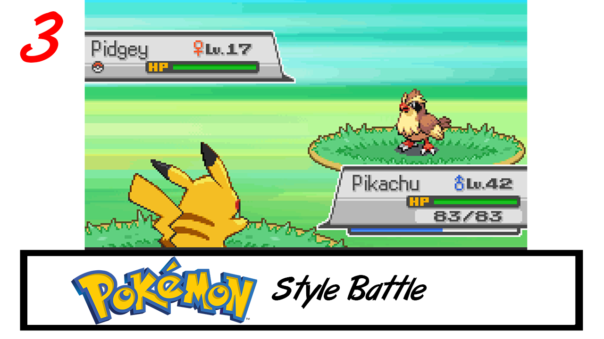

##### Style 4 - Ace Attorney Investigations
While not an RPG series, the Ace Attorney games are puzzle games, where the main "combat" encounters take place with a courtroom, featuring the attorney and prosecutor in a battle of wits, in the mainline games these characters take up a full screen to themselves. However, the spinoff Ace Attorney Investigations features the two characters on one screen, duking with their words. Considering the dynamic experessions and how it requires you to "talk to fight", I thought this would be a good fit for the style of game we are making.

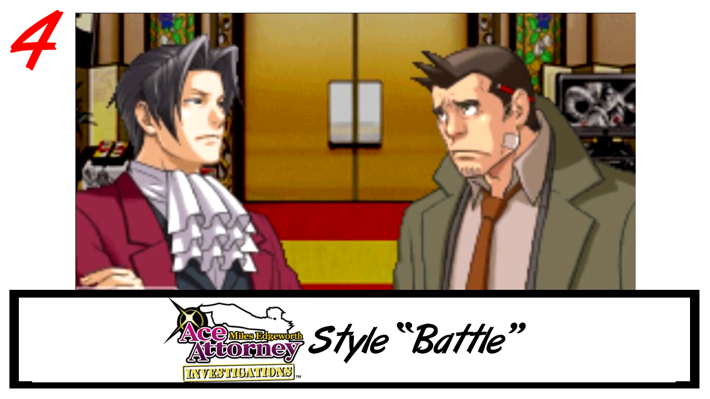

##### Style 5 - Fear and Hunger
As a relatively unknown RPGMaker Horror game, Fear and Hunger features gruelling and cruel combat encounters, many of which encounters you can talk to the enemy to try and distract them, find out information or damage their mind by answering their questions. This game features front on enemies, similar to Undertale, while the player characters you see from the back in 3/4 perspective, like with Pokemon.

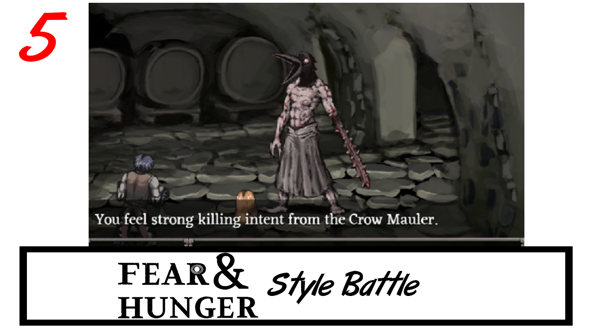

#### Menu Style
Next up we need to consider how the player will respond to the enemy's questions.
##### Menu 1 - List
This is arguably the most popular style of menu in RPG games, having a scrollable list for players to search through for their answer, relativly simple to implement and does what it needs to.
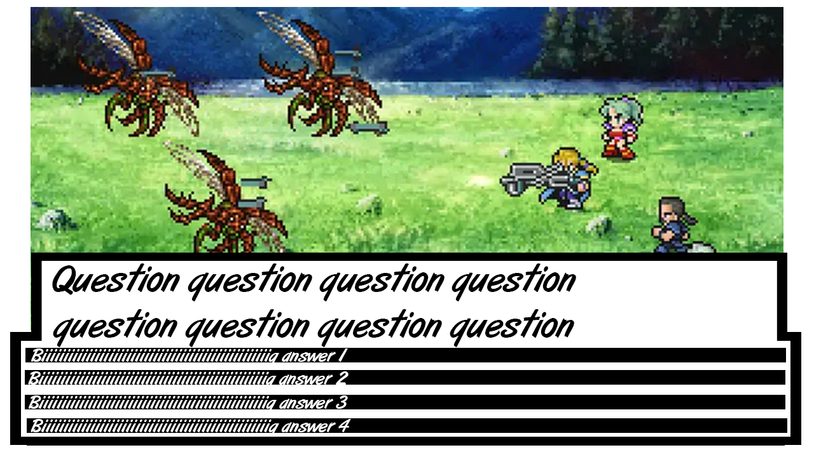
##### Menu 2 - Square 
Having a square menu style with 4 options is definitely less popular in the genre, but still features in the monolithic franchise Pokemon, and given our Q&A combat having 4 answers, this style may work quite well, being slightly more difficult to implement however.
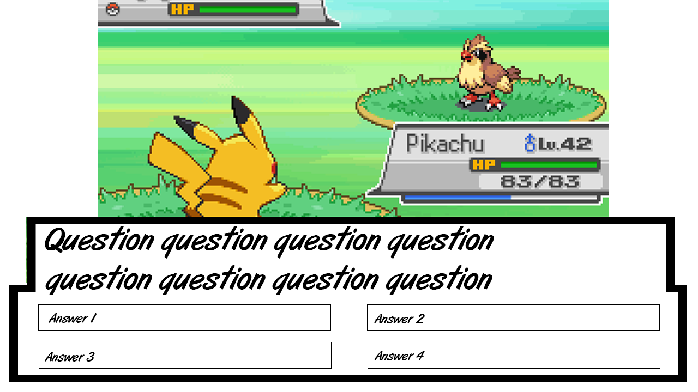

#### Main Character Design
Next up we need to decide on a design for our main character, given we have already decided on our setting to be "IBM employee transported to another world" we already have restrictions in place, however there are still a number of decisions to make on main character design, such as:

- Body Type
- Race
- Age
- Clothing
  - Suit
  - Hoodie
  - Trousers
  - Shoes
- Hair
  - Colour
  - Style
  - Facial Hair

Main characters in RPGs vary wildly depending on setting, thus I think the best way to come up with our main character is to brainstorm rather than look at existing examples of main characters.

#### Sprite Sheet
Once the main character's design is decided upon, we can start making our custom sprite sheet, which will contain all of the animations for world traversal.

One of the biggest things to consider with sprite sheets is the amount of space they take up relative to the world around them, traditional RPG style has the world split into "tiles", which can be thought of like a square grid, in which the characters normally move between these tiles, and normally mean that sprites have to fit into that square area. However newer top-down 2d games are less restrictive, and have more free movement, which also means that character sprites do not have to conform to set tile space

The sprites I am showing off in this section are all walking animation sprites, with a step-stand-step style of animation, which is simple to animate, but works brilliantly, and is still used in modern top down games today

##### Sprite Sheet 1 - Final Fantasy 6
Final Fantasy 6 sprites differ from the rest as they only have 2 frames on their sideways walk, they are slightly taller than a single tile, but would work for a tile-based game, and are relatively simple. And considering the person doing the art for our group does not have a great deal of experience, simple sprites are probably better.
##### Sprite Sheet 2 - Fear and Hunger
Fear and Hunger sprites are 2 tiles tall, this means that while their hitbox is in their lower half, they also have an upper half, which lets them appear much more human and realistic. These sprites are much more complicated, but look amazing because of it.

##### Sprite Sheet 3 - Stardew Valley
Stardew Valley's sprites do not conform to the tile system, but character designs are still simple, yet appear move humanlike by not conforming to tiles.

##### Sprite Sheet 4 - Pokemon
Pokemon games are the classic representation of tile-based sprite sheets, and while simple and stylised, they also carry alot of detail.

##### Sprite Sheet 5 - RPGMaker
RPGMaker is a game engine inspired by classic RPG games, and thus operate off a tile system, with their example sprites all fitting into one tile.

##### Sprite Sheet 6 - Simple Style
Finally, we have the super simple 16x16 sprites, which conform to tiles, but lack a lot of detail.

#### Health
Our current idea for battles is to have it so that answering a certain number of questions correctly defeats the enemy, but answering incorrectly enough times will mean you lose the game. In this case we need a way to keep track of the number of questions, and the most traditional way to do this is through a health system.

There are two main ways to display health in video games, and we need to decide which is best for our game.
##### Health Bars
A health bar is quite simply a bar to display health, normally analogue in nature.
Take this screenshot from Guilty Gear Xrd, a fighting game released in 2014. At the top of the screen there are two health bars to represent each character's health.

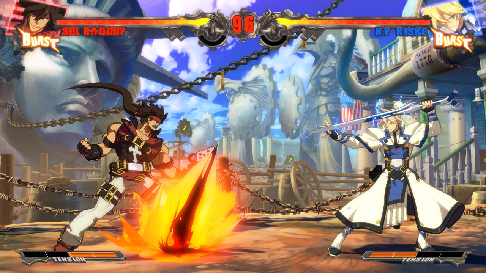

As this health bar depletes it will "empty" towards the centre of the screen.

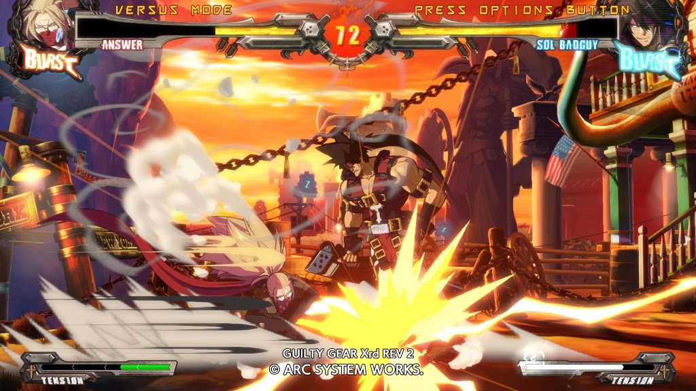

Or take this screenshot from Trails from Zero, an RPG originally released in 2010, which features 4 "party members" each of which having 3 bars, "Health Points", "Energy Points" and "Craft Points", each of which deplete towards the left as you use them or are damaged. In addition, if you bring your Craft Points over 100, there is another bar, in a lighter colour of green, that overlaps the original bar, which is commonly used in games to represent a strong character having multiple health bars.

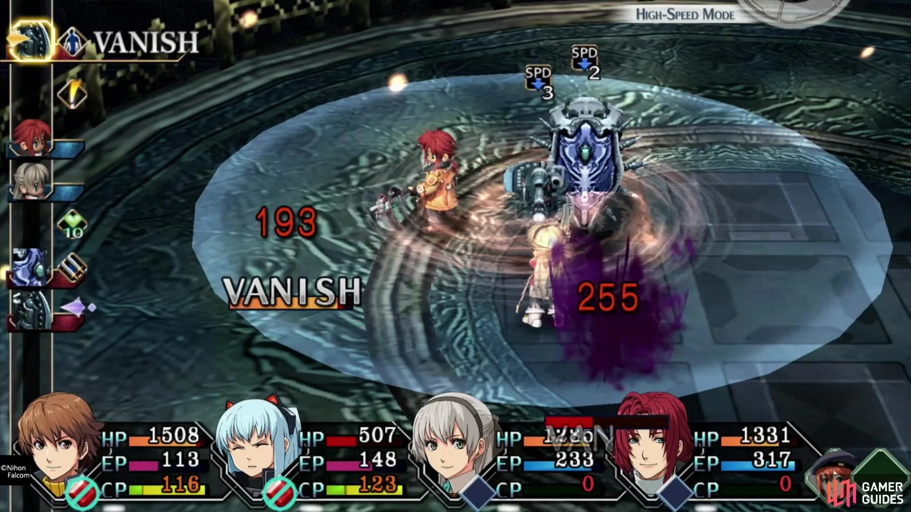

The advantages of health bars is that they simple and easy to look at, as they can be represented numerically, and can be manipulated freely

##### Heart Bars

Heart bars are a more discrete representation of health bars, as instead of having a large number to represent health, you instead have a more constant smaller numerical representation, and each piece of damage would represent one "heart".

In Minecraft you have 10 hearts, where each piece of damage counts for a quarter of a heart, thus giving a visual representation of 40 hit points.

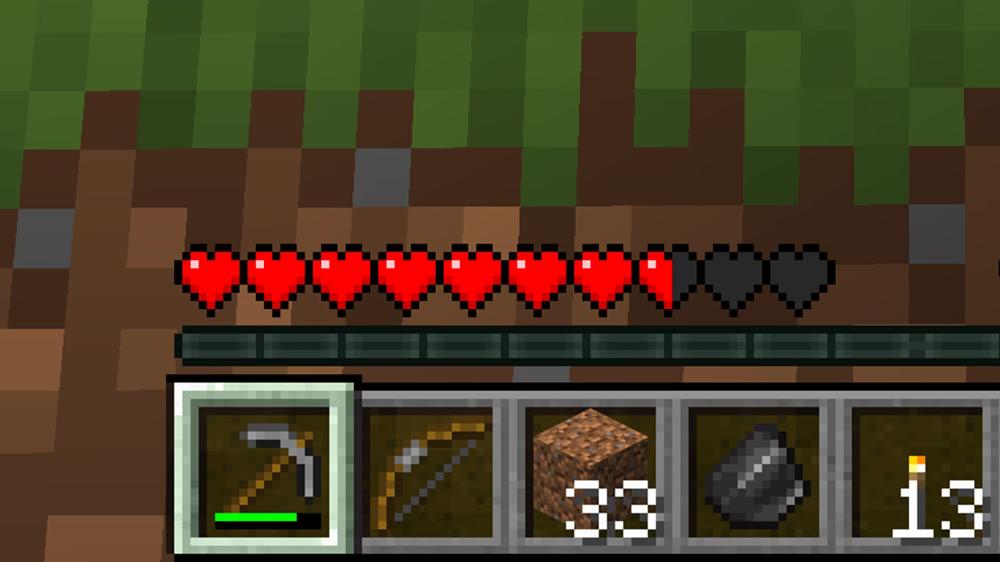

In addition, if you have the "absorption" effect, you get bonus hearts, which overlay the regular hearts, represented by their yellow colour.

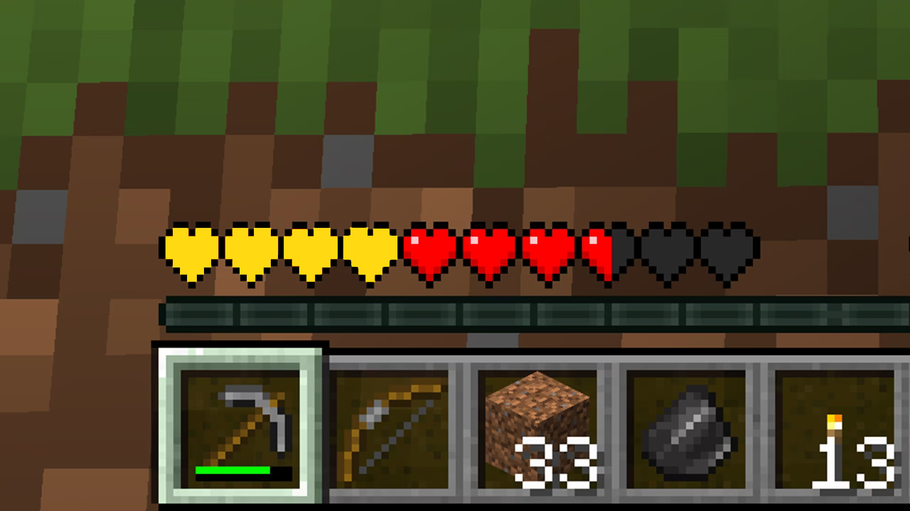

The positives of heart bars are they also allow you to represent health in unique ways, for example in hollow knight, each piece of health is represented by a "mask", thus this concept allows for more creativity, as we can represent health as whichever item we desire, however this would require a lot more programming and asset creation.

[Go back up](#table-of-contents)
## Overview of what needs to be done for the game:
1. Main menu
    -  New game
    - Continue
    - Settings
    - Controls
    - Credits
    - Exit
2. Pause Menu
    - Continue
    - Controls
    - Exit
3. Intro cutscene with john
    - Character selection
4. Cutscene where you get sucked into the computer
5. Hub World
6. Creation of other worlds with specific puzzles
7. Interactable objects for documentation
8. Combat system 
9. Skill tree
10. Item collection / inventory
11. Final Boss
12. Final cutscene

[Go back up](#table-of-contents)
## Communication

### What we learnt from Online Meeting (18/10/2023):

- Age group: Secondary, Uni
- Not violent / inappropriate
- Game which allows pause
- Puzzle / Q&A
- CAPSTONE badges should be used for questions
- Needs to have saving feature
- Sprite of John needs to be in the game

## [Learning Journal](https://docs.google.com/spreadsheets/d/1IZtANq7ruhhZvN3znZopCmB7hLXw76JRNAhnZD1jfeE/edit?usp=sharing)

[Go back up](#table-of-contents)