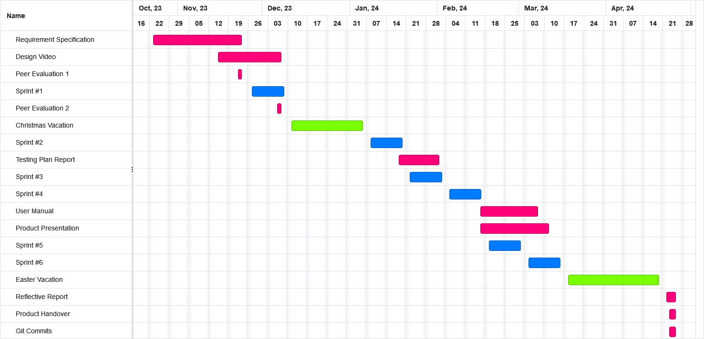

## 1 - Introduction

### 1.1 - Overview and Justification

Our client is IBM, and our contact at IBM is Mr John McNamara. We have been tasked to reimagine Skills Build as an RPG game. This RPG game must facilitate accessing IBM Skills Build courses by linking the courses and its subsequent knowledge check questions, as well as reward users with in-game items (powerups and progression) if they are able to answer them. 

The game should also be fun and engaging to the user; it would be an amazing study tool integrated smoothly into an engaging RPG experience. However, the game does not need to teach the course content, but can refer to the courses from which the IBM Skills Build badges are obtained. This game is aimed to appeal to high school and university students, and hence should be accessible to people with little or no knowledge of Computer Science.

This document is the Requirement Specification for our RPG IBM Skills Build project. There are three parts to this document. The first part is the introduction, which gives a high-level description of the project, its scope, and domain area. The second part, the Solution Requirements, is the main part of the requirement specification. This part specifies the projects functional and non-functional requirements, and assess the risks/issues which may occur when undertaking the project. The third part describes our approach to the development of the game, as well as our time schedule in order to complete the project within the agreed deadline.

### 1.2 - Project Scope
The goal of our project is to create an RPG game to reimagine Skills Build, IBM's platform to provide people with job skills, courses and credentials. The purpose of this project is to make Skills Build easier to navigate and make it more interactive so that it increases receptiveness for students. The base of our game is a hub world with areas corresponding to different courses, each area would have a boss that would be the center of combat gameplay. Upon choosing an area the player will have to complete puzzles and combat that have course questions as the core. This will allow them to progress further. A health system also comes into play with combat themed games, whereby running out of hearts would result in restarting the fight, this would be somewhat similar to quiz questions in courses where achieving a score less than 80% would require you to take it again.

This game aims to address the problem of accessibility for people with little to no knowledge of Computer Science. It resolves this problem by creating puzzles and combat themed areas to answer challenging questions, earn Skills build badges and complete courses. Rewarding users with power-ups and level progressions incentivizes them, particularly high school and university students, it also makes learning more engaging.

Future Versions of the game could include:
Expansion of the amount of courses provided, right now only introductory lessons would be connected to the game, further development could increase the amount of courses the game would provide.
Altering game content to include teaching material instead of just knowledge checks.
Changing sprites to original characters.

### 1.3 - System Description

#### Our proposed System

Our proposed solution to IBM's Skills Build Website issue is the creation of an educational 2D RPG game, featuring questions from the Skills Build website. These questions will be at the forefront of the game and will allow the player to progress, when answered correctly. Each Skills Build course will be represented by an area in the game and each area will feature puzzles and a boss, which will pose questions to the player. Combat will introduce a further element of risk, in the form of a health system which deducts a heart from a player on answering a question incorrectly. Loss of all hearts results in the player restarting the entire fight. A skill tree will enable the player to alter combat to suit their play style, by choosing powerups after defeating each boss. All areas will be linked by a hub world, allowing the player to select an area in which to enter, in any order they please. All of our choices for the game were based on market research found [here](https://github.com/COMP2281/software-engineering-group-17/blob/main/readme/market-research.md)

#### Existing Solutions

> **Mario is Missing (by Nintendo)**
>
> **Description:** Mario is Missing challenges the player to save global landmarks stolen by Bowser. By learning about geography from non-playable characters (NPC's) the player is able to identify and return the landmarks to their correct geographical location. The game acts as an educational tool by improving the players' geographical knowledge through exploration of locations.
>
> **Advantage:** The game acts as an educational tool by improving the players geographical knowledge through exploration of locations.
>
> **Disadvantage:** As the games target audience is children, it is extremely easy. Furthermore, the answering of questions during play is not mandatory and so the educational aspect of the game can be avoided.
>
> **Use for our System:** Negative reviews suggest the gameplay cycle of finding landmarks to be tedious and the questions unnecessary. Our game should contain essential questions with other gameplay elements to engage players.

> **Minecraft Education (by Microsoft)**
>
> **Description:** Minecraft Education enables students to engage with lessons created by teachers in Minecraft which focused on academic subjects.
>
> **Advantage:** The game facilitates learning through fun interactive classes. Learning is at the forefront of the game and knowledge gained can be directly applied to non gaming environments.
>
> **Disadvantage:** Players familiar with Minecraft will feel frustrated, as many core gameplay features are limited to facilitate learning.
>
> **Use for our System:** Players of our game who know the answers to all questions should be able to complete the game more quickly, but the game should still have interactive puzzles to engage players.

> **Mario and Sonic at the Olympic Winter Games 2010 DS (by Nintendo and Sega)**
>
> **Description:** Bowser and Dr. Eggman have imprisoned the Snow Spirits to sabotage the Olympic Winter Games and Mario and Sonic must save them. The educational aspect of the game is delivered through Winter Olympic themed trivia scattered around the game world.
>
> **Advantage:** The trivia notes, which are location specific, are hidden around the world and so well integrated into the game. The player is rewarded for finding the information, with completionist badges.
>
> **Disadvantage:** The game is not focused on these trivia notes, rather they are an additional feature, which despite it giving the player a badge, does not facilitate progression: They are a side quest.
>
> **Use for our System:** Our game should reward the player for answering questions correctly and enable progression. Without correctly answering the questions, the player should not be able to progress. The questions asked should fit the environment of the game.

## 2 - Solution Requirements

This part of the document has three sections - functional requirements, non-functional requirements and risks/issues.

### 2.1 - Function Requirements

Below is a dependency graph for our functional requirements:

#### **Player-Based system**

| ID, Type, Title | FR1.1 - Player-Based system - Player Character |
| ------------ | --------------------------------------------------------------------- |
| Description  | Main playable character which the game centers around, which should be a student (user) stand-in. |
| Priority / MuShCo | High / Must have |
| Dependencies | N/A |
| Expected results | Character should have distinct/unique sprite both in and out of battle (small zoomed out model outside of battle, portrait outside) |
| Exception handling | If a sprite cannot be loaded, character sprite will be a placeholder |

| ID, Type, Title | FR1.2 - Player-Based system - Player Character Movement |
| ------------ | --------------------------------------------------------------------- |
| Description  | Buttons which allows the player character to move in any direction (even though the stages are built within a grid) but does not allow the player do go through walls, closed doors, or occupied tiles. |
| Priority / MuShCo | High / Must have |
| Dependencies | FR1.1, FR2.5 |
| Expected results | Player character should be able to move in the four cardinal directions and diagonally with either WASD, the arrow keys (holding a combination of two keys, say W and A, would make the player move diagonally up and left) or via controller, but if moving in these directions would imply colliding with a wall, door or occupied tile |
| Exception handling | If the player gets stuck on a tile, they should be able to wiggle out and free themselves either by mashing all directions or holding one direction |

| ID, Type, Title | FR1.3 - Player-Based system - Controls |
| ------------ | --------------------------------------------------------------------- |
| Description  | Buttons which allows the player to interact with both the game entities (items/characters) and the menu. |
| Priority / MuShCo | High / Must Have |
| Dependencies | N/A |
| Expected results | There should be at least two buttons like that of the old gameboy. [A] generally for accept, and [B] generally for cancel. If a player character is between two game objects, the one they are closer two should be the one being interacted with |
| Exception handling | N/A |

#### **Game System**

| ID, Type, Title | FR2.1 - Game System - Main Menu |
| ------------ | --------------------------------------------------------------------- |
| Description  | A menu which is opened at after launching the game. |
| Priority / MuShCo | High / Must have |
| Dependencies | N/A |
| Expected results | The menu should have the game ID, Type, title, a background, and buttons. Contains buttons to: Make a new game, continue an ongoing session, open the options, quit and close the game window |
| Exception handling | N/A |

| ID, Type, Title | FR2.2 - Game System - Pause Menu |
| ------------ | --------------------------------------------------------------------- |
| Description  | A menu which pauses the game when opened, with an options menu, with options available such as quitting. |
| Priority / MuShCo | High / Must have |
| Dependencies | FR1.3 |
| Expected results | After pressing the [Esc] button, a menu should open up. When this menu is open, all entities and events should be paused. This menu contains buttons to: Access the inventory, save the game, open the options menu, or quit (to the main menu or to the desktop) |
| Exception handling | If opened during a timed event, the menu should not open |

| ID, Type, Title | FR2.3 - Game System - Saving |
| ------------ | --------------------------------------------------------------------- |
| Description  | A button to save the player's progress at any point in the game and auto saves should automatically be done throughout the game. |
| Priority / MuShCo | Low / Could have |
| Dependencies | N/A |
| Expected results | In the case that the user wants to take a break, or wants to go on Skills Build to learn about the topic, they should be able to save their progress in case they did something wrong, or in case the game crashes and be able to load back their save file |
| Exception handling | If the save failed, the user should be notified and asked if they want to save again |

| ID, Type, Title | FR2.4 - Game System - Inventory |
| ------------ | --------------------------------------------------------------------- |
| Description  | A menu where the player can see all their currently collected items. |
| Priority / MuShCo | Medium / Should have |
| Dependencies | FR3.2 |
| Expected results | A menu that shows the user their current items and their descriptions. Perhaps this menu can also display the other items the user can get, but shade them out if the user has not gotten them yet. The user cannot read the descriptions of shaded items. This menu also shows the user their Skills Build |
| Exception handling | N/A |

| ID, Type, Title | FR2.5 - Game System - Camera |
| ------------ | --------------------------------------------------------------------- |
| Description  | A camera that is able to track the player character, and move around a room. |
| Priority / MuShCo | High / Must have |
| Dependencies | FR1.1 |
| Expected results | This is the main tool to display the game. Most of the time, the camera will be centered on the player character, but it can be used to pan around a room |
| Exception handling | In the rare case that the camera is not centered around the player character, there should be a button (in the pause menu) to center the camera. Only implement if the camera gets stuck frequently |

#### **Gameplay Systems**

| ID, Type, Title | FR3.1 - Gameplay Systems - Combat |
| ------------ | --------------------------------------------------------------------- |
| Description  | The game should have a combat system, where the player has a health bar and takes damage when attacked by enemies. |
| Priority / MuShCo | Medium / Should have |
| Dependencies | FR3.2 (Co-dependencies) |
| Expected results | A (decorated) bar which depicts the health of an entity. Once this reaches zero, the entity should die. It should show the current health, and the maximum health, and the player should take damage when attacked. |
| Exception handling | If the player character somehow stays alive with negative health, they should lose at the start of their next action |

| ID, Type, Title | FR3.2 - Gameplay Systems - Skills Build System |
| ------------ | --------------------------------------------------------------------- |
| Description  | A system which permanently upgrades the player character as the game progresses. Can be accessed through a menu. |
| Priority / MuShCo | Medium / Should have |
| Dependencies | FR3.1 |
| Expected results | A skill tree which has nodes that provides various benefits, like giving the player character more health or attack. After finishing a world, the skill associated with that world unlocks. Nodes can be activated by spending skill points/ or acquiring unique items |
| Exception handling | If the player somehow has negative skill points, they should not be able to quit the Skills Build menu |

#### **Gameplay**

| ID, Type, Title | FR4.1 - Gameplay - Central Hub |
| ------------ | --------------------------------------------------------------------- |
| Description | A central hub world where the user can access other world. |
| Priority / MuShCo | Medium / Should have |
| Dependencies | FR4.2 |
| Expected results | The user can, from the hub world, access all the main worlds in any order. This place will be more fleshed out compared to other place since the user will return here a lot |
| Exception handling | N/A |

| ID, Type, Title | FR4.2 - Gameplay - Worlds |
| ------------ | --------------------------------------------------------------------- |
| Description  | The different realms where the game takes place. Each world contains many rooms and ends with a boss fight. |
| Priority / MuShCo | High / Must have |
| Dependencies | FR4.5, FR4.4 |
| Expected results | At least five main worlds, each with their own puzzle style accessible through the central hub. Each world represents a Skills Build course |
| Exception handling | N/A |

| ID, Type, Title | FR4.3 - Gameplay - Rooms |
| ------------ | --------------------------------------------------------------------- |
| Description  | A room that contains a puzzle or a boss with a door to the next room, with a puzzle |
| Priority / MuShCo | High / Must have |
| Dependencies | FR4.3 |
| Expected results | A room has at least one entrance, and can have none or multiple exits. The room size can be from one screen to multiple screens. After entering through a door, the player character is placed right outside the door of another room, and the door to the next room should only be opened once the problem or boss is defeated |
| Exception handling | N/A |

| ID, Type, Title | FR4.4 - Gameplay - Puzzles |
| ------------ | --------------------------------------------------------------------- |
| Description  | Themed minigames |
| Priority / MuShCo | Medium / Should have |
| Dependencies | FR4.3, FR4.5 |
| Expected results | Puzzles have a theme in each world. Most puzzles will be a multiple choice question disguised as a minigame |
| Exception handling | Some puzzles will require a reset button, which restores the state of the room its in to how it originally was |

| ID, Type, Title | FR4.5 - Gameplay - Multiple Choice Question |
| ------------ | --------------------------------------------------------------------- |
| Description  | Questions from a Skills Build course which the user must answer |
| Priority / MuShCo | High / Must have |
| Dependencies | N/A | 
| Expected results | Questions are taken from the Skills Build quizzes. Some are multiple choice, others are typed in answers |
| Exception handling | N/A |

| ID, Type, Title | FR4.6 - Gameplay - Boss Fight |
| ------------ | --------------------------------------------------------------------- |
| Description  | Fights where the user has to correctly answer questions from the world it is in |
| Priority / MuShCo | Medium / Should have |
| Dependencies | FR3.1, FR3.2, FR4.6 |
| Expected results | Both the player character and the boss has a health bar. If the user answers a question correctly, they get to attack the boss. If they don't answer correctly, they get hit by the boss. Bosses can ask any questions from the previous puzzles, and maybe more, in their respective world. The final boss should be able to ask questions from any of the other worlds |
| Exception handling | If the fight lasts long enough, there will not be enough unique questions to ask the user. To prevent this happening, questions can be reused after all other questions gets exhausted |

#### **Audio**

| ID, Type, Title | FR5.1 - Audio - SFX |
| ------------ | --------------------------------------------------------------------- |
| Description  | Sound effects for some actions, such as room transitions and background music for the game and combat music for fights |
| Priority | Low / Could have |
| Dependencies | N/A |
| Expected results | Sounds should be made for most of the common actions, like opening menu, or attack an enemy, or walking through a room, music should loop indefinitely |
| Exception handling | N/A |

### 2.2 - Non-Functional Requirements

#### **Playability**

<!-- | ID and Title | NFR1.1 - Windows                                |
| ------------ | --------------------------------------------------------------------- |
| Type | Compatibality |
| Metrics | Game should be able to run on windows 10 and 11 | -->

| ID and Title | NFR1.1 - Executable file |
| ------------ | --------------------------------------------------------------------- |
| Type  | Usability |
| Metric | The game can be launched by running a single executable file |
| Constraint | The user must be on windows OS |

| ID and Title | NFR1.2 - Platforms                                      |
| ------------ | --------------------------------------------------------------------- |
| Type | Usability |
| Metric | Game should be playable on mouse & keyboard as well as controller |
| Constraints | Not all controllers need to be supported, just common ones e.g. Xbox and Playstation controllers |

#### **Customization**

| ID and Title | NFR2.1 - Graphics                                                      |
| ------------ | --------------------------------------------------------------------- |
| Type  | Usability |
| Metric | Graphics abide by the Game Accessibility Guidelines, so the game is enjoyable for users suffering from colour blindness |

#### **Gameplay**

| ID and Title  | NFR3.1 - Response Time                              |
| ------------ | --------------------------------------------------------------------- |
| Type | Performance |
| Metrics  | There should be less than 0.1 seconds of delay between pressing the movement/interacting keys and the player moving/interacting |
| Constraints | User has a good enough machine |
<!-- need to modify constraint, not sure what to put -->

| ID and Title | NFR 3.2 - Smooth Movement |
| ------------ | --------------------------------------------------------------------- |
| Type | User Experience |
| Metrics  | Movement speed and animation should be such that the movement feel natural |

| ID and Title | NFR 3.3 - Beginner Friendly                               |
| ------------ | --------------------------------------------------------------------- |
| Type         | Usability |
| Metric | Game and UI should be intuitive to use even for people who have not played games |

| ID and Title        | NFR 3.4 - Room Transitions                               |
| ------------ | --------------------------------------------------------------------- |
| Type         | Performance |
| Metric | Transition between scenes should be smooth - there should be no more than an x second delay when moving to another room |
| Constraint | There should still be some fading effect |

| ID and Title        | NFR 3.5 - Boss Battles                               |
| ------------ | --------------------------------------------------------------------- |
| Type | User Experience |
| Metric | Battle should feel engaging to the user |
| Constraint | User must learn the relevant topics through IBM Skills Build beforehand |

| ID and Title        | NFR 3.6 Music                               |
| ------------ | --------------------------------------------------------------------- |
| Type | User Experience |
| Metric | Music should fit each area |

| ID and Title        | NFR 3.7 Progression                             |
| ------------ | --------------------------------------------------------------------- |
| Type | User Experience |
| Metric  | The game must have an aspect of progression where items are gained which benefits them |

### 2.3 - Risks and Issues
This section outlines our potential risks, how they could harm out project, and how we plan to mitigate these risks.
| Probability of Happening / Potential Consequences | Almost Impossible (1)| Not Likely (2) | Could Happen (3) | Known to Happen (4) |
| - | - | - | - | - |
| Insignificant (1) | 1 | 2 | 3 | 4 |
| Minor (2) | 2 | 4 | 6 (R4) | 8 |
| Moderate (3) | 3 | 6(R7) | 9 (R2,R6) | 12 (R5) |
| Major (4) | 4 | 8 (R8) | 12 (R1) | 16 (R3) |

| Hazard | What is at Risk? | How could they be harmful? | Uncontrolled Risk Level | How to minimize the risks | Controlled Risk Level |
| - | - | - | - | - | - |
| R1 - Not Being Completed on Time | Project timeline & client satisfaction | Delays result in missing milestones, which will disappoint the client | 12 | Implement a well-defined schedule and monitor progress to deal with issues | 6 |
| R2 - Group Dynamic | Team cohesion & project quality | Arguments lead to lower quality product, and delays | 9 | Establish clear roles and responsibilities, address issues promptly | 4 |
| R3 - Lack of Group’s Technical Knowledge | Project quality and timeline | Inability to meet project requirements | 16 | Identify skill gaps and train to fill gaps | 9 |
| R4 - Scope Creep (uncontrolled expansion of project) | Project timeline | Project not completed on time due to base features not being completed| 6 | Define project scope clearly, use agile methodology to add new features after base completed | 4 |
| R5 - Team Member Drops Out or is Unavailable | Group members & project timeline | Other group members have more work, delays if key member | 12 | Cross train team members, or have backup plans | 6 |
| R6 - Poor User Feedback | User acceptance & client happiness | Fail to create a positive user experience | 9 | Conduct occasional user testing and gather feedback | 4 |
| R7 - Requirements Change | Project scope & timeline | Will have to go back and change content, potentially from a fundamental level | 16 | Document and manage project requirements, make the game flexibly to adapt to change | 8 |
| R8 - Hardware Compatibility | Game performance or accessibility | Poor performance or being unable to play on systems should | 6 | Test on a number of platforms and hardware configurations | 2 |

## 3 - Project Development

### 3.1 - Development Approach

#### Agile Versus Plan Driven
Due to the nature of video games, it can be very difficult to approach this project from a plan driven perspective, as video games are very subjective, and while there are many tasks that have a clear point where you have or haven't achieved it, video games are more oriented around how enjoyable the experience is to the player, which is a difficult metric to define. As such it would be very difficult to plan the entire game out in the beginning and build it as designed. As such we will be taking an agile scrum approach to development, as it helps us in a number of ways:

1. Adaptability to Change:

As mentioned, features and priorities will greatly change as development progresses, thus by taking a scrum approach, we can take a step back and approach something from a different angle whenever we face an obstacle in our path, while the rigid nature of a plan driven approach will not allow for this natural change to happen.

2. Client Involvement

As we are making this RPG game for a client, the subjective nature of video games means that as we make regular updates to our client, there may be things to change, or we may have to tackle a problem differently in order to suit our client's needs, having an agile methodology suits this nicely. A plan driven approach would mean that we run the risk of the client not being happy, once the game is basically finished.

3. Cross-Functional Teams

Everybody in our team has a different level of knowledge when it comes to game development, where some know a lot and some not at all, by taking an agile approach, team members can share knowledge and collaborate easier, rather than everybody having a set, strict, set of tasks. A plan driven approach would make our team much less flexible, and may cause major issues if a member ends up falling ill or dropping out.

4. Improved Risk Management

In the event that something doesn't go to our general plan, a scrum style approach will let us, identify and mitigate any risks that arise within our sprints quickly. In a plan driven approach, if any issues were discovered late, it could be costly to address.

5. Incremental Development

An agile development means that the game will be built up feature by feature in small manageable increments. This allows us to prioritize features like gameplay mechanics and character art, while leaving other features such as cutscenes and sound effects until the end.

#### Team Roles

While the majority of our team do not have set roles, other than James, who is our artist, and Josh, our lead developer. We mostly plan on working on the game in small increments, with each of our five members handling their own piece of game development, as we are assigning every member their own world to design, once base asset creation is completed, as this will allow us to simultaneously build the game up, and deal with any problems as they arise. In addition, we will be assigning individual members tasks based on the level of complexity and prior knowledge.

In the end this approach is best for our team due to our existing skillet, and also allows individual member's talents to shine.

### 3.2 - Project Schedule

The Gantt Chart shown below outlines the development time for our project and highlights the academic deadlines too.

The chart takes into account the number of members and the weekly workload we have; we hare 5 members, and on average work on Software Engineering for 4h per week plus any extra time voluntarily invested. The aim by the end of the holiday is to have in place all the base content that will be used as the building blocks of every world, so that each team member can create a world individually, with no dependencies halting progression. We expect that productivity after the holiday will subside, due to lectures resuming and other coursework deadlines being set throughout the term. To combat this, we have given a large extended time to the creation of each world, which gives members enough time to flesh out their ideas and invest enough time into compelling gameplay. Art assets are imported when finished, with placeholders being created whilst waiting for the assets. Music and cutscene are non-vital components of our game and will thus be added at the end if time allows. The team also thought about agile vs waterfall model and after drafting up a waterfall model of the project found [here](https://github.com/COMP2281/software-engineering-group-17/blob/main/image/Documentation/Gantt_chart_waterfall.png), decided against it as, due to our lack of game development knowledge it is safer to go with a model that allows for a lot of deadline flexibility. Beyond restating the summative deadlines, the team also added tasks that describe the game creation process and thought about subsection for each task where necessary:

**Initial Game Setup:** Creating a template player character complete with movement and collision, tilemap, interactable objects, Hub World

**Combat System:** Creating a template boss and the player health/damage systems.

**Main Menu:** Creation of 5 buttons: new game, continue game, controls, credits and exit. 

**Pause Menu:** Creation of 4 buttons: controls, save and exit, inventory, Skills Build tree.

**Art:** 2 sections; art creation and art sourcing. Art sourcing includes tile sets, text fonts, NPC sprites, interactable objects and inventory items. Art creation includes player character, boss fights and all puzzle elements.

