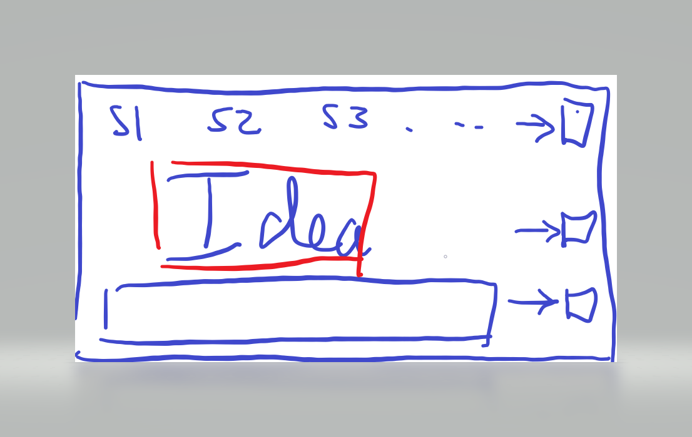
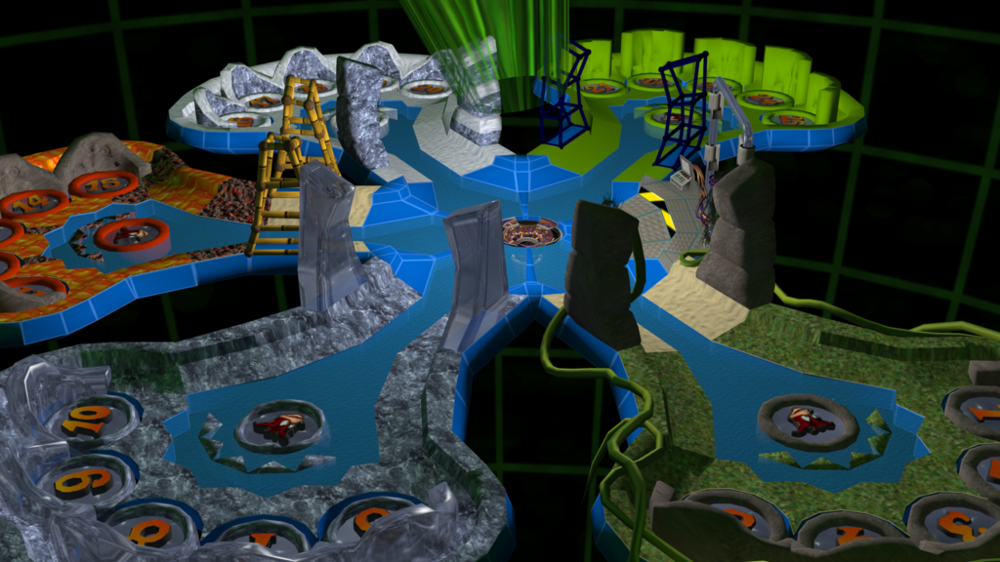
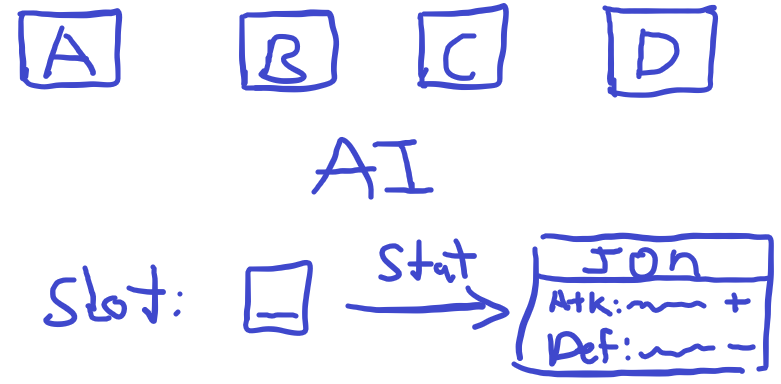
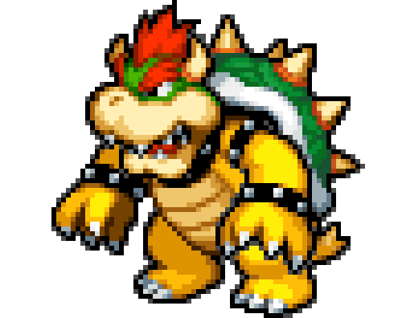
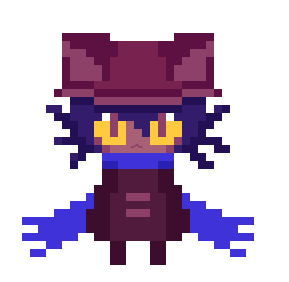
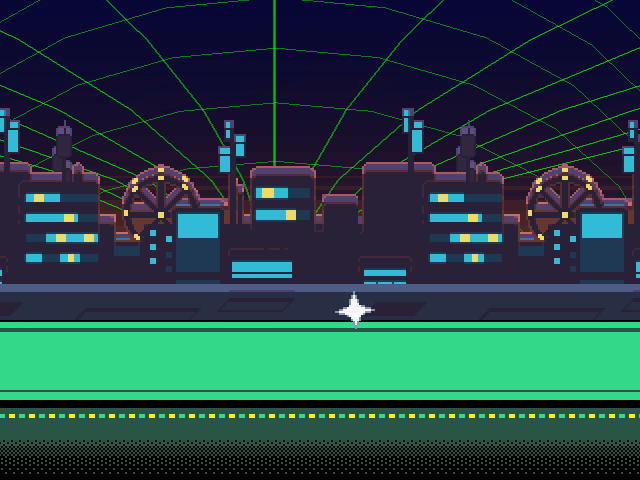

# Ideas 

## Inspiration - Undertale / Deltarune

- The player is an IBM employee and gets transported to a world in his computer
- Everything from his job appears in the world
- His computer is corrupted and needs fixing (he also wants to go back home)
- Make a top down 2D rpg
- Doors block the way forward, players must answer questions to proceed
- Players can find answers to questions through combat and puzzles
- Combat will have the option to “scan enemies” for information to get clues on how to answer questions
- Have puzzles where the layout is basically trying to mix and match items. Can also include Q&A

## Learning Game with Rewards

- The player answers various questions to gain points
- These points can then be traded to play minigames

## Top Down Puzzle RPG

- The player is an IBM employee and gets transported to a world in his computer
- Everything from his job appears in the world
- His computer has a virus and needs to be fixed in order for the employee to go back
- Doors block the way forward, players must answer questions to proceed
  - In order to answer these questions players must find the right answer through puzzles
- Bosses will exist between some puzzles
  - Bosses will be difficult and involve answering questions to damage the boss and avoiding damage by answering questions in quick time events
- Intro scene
  - IBM John welcome you to your new job at IBM SkillsBuild
    - What is John going to wear? Suit, hoodie, shirt, tshirt, jeans, suit, trousers?
  - Ask who you are: Choose a character (similar to pokemon)
  - Then you end up in your room working on your computer

- Thinking face

- What is John going to wear? Suit, hoodie, shirt, tshirt, jeans, suit trousers?

- Wrath of Cortex style hub world (see image above)
- Magical Macguffin- Magical object that drives plot forward, for example, the holy grail, the triforce, pandora's box
  - Quint-force - inspired by tri-force, object made of 5 pieces, required to either defeat final boss or access final area
  - Master Sword style weapon - used to destroy final boss, or create a rip in the world they are transported to, allowing main character to escape
  - Magical macguffin can work with a skill tree
- Pixel art characters - black borders in real world, purple borders in virtual world (No Game No Life style)
- Each area (world) will have its own distinct style
  - Cloud - Sky Islands
  - Journey to cloud - Victory road style
  - AI - Cyberpunk/Synthwave City
  - Data Science - Very Tedious Dungeon, Warehouse
  - Threat Intelligence - Volcano?
  - Final Area - Wireframe/virtual world falling apart. Mainframe?
  - Final boss is a recap of everything
- Puzzle ideas:
  - Conveyor Belt puzzle
  - Puzzle where you control 2 characters at once and move them to hit buttons
  - Teleports
  - Parts Builder AI
  - Pokemon gym puzzles
  - Baba is you
  - Square thing where you move blocks around to make an image
- Skills Build Tree
  - Magical Macguffin from boss: can slot into skills build tree, player chooses what bonus they want

  - AI
    - Health
    - Defense
    - Dodge Chance
  - Threat Intelligence
    - Attack
    - Armour Piercing
    - Lifesteal
  - Data Science
    - Could do joint skill trees like AI/Threat Intelligence and Cloud/Data Science, allowing for 3 options in each, of which by the end you have chosen 2 of 3
  - Cloud
- Overivew of what needs to be done for the game:
  1. Main menu
      -  New game
      - Continue
      - Settings
      - Controls
      - Credits
      - Exit
  2. Pause Menu
      - Continue
      - Controls
      - Exit
  3. Intro cutscene with john
      - Character selection
  4. Cutscene where you get sucked into the computer
  5. Hub World
  6. Creation of other worlds with specific puzzles
  7. Interactable objects for documentation
  8. Combat system 
  9. Skill tree
  10. Item collection / inventory
  11. Final Boss
  12. Final cutscene

