# Market Research

Before we can begin with new asset creation, we need to finalise some of the more in depth points about world traversal and combat.

## Game choises based on Research

| Key aspect of the Game | Research | Justification |
| - | - | - | 
|Character Sprites | Inspired by sprites from Pokemon games | Moderate complexity and 2.5D view models allow our rookie artist enough freedom to create sprites of moderate complexity |
|Combat|Inspired by Phoenix Wright games| Debates in Phoenix Wright provide a fitting template for combat based on questions|
|Questions|To be introduced through combat and puzzles| These forms of gameplay enable us to build questions into them easily|
|Combat Menu|Dynamic list|Easy incorporation with the chosen combat style|
|Health system|Based on Minecraft and Hollow Knight| An incorrect answer to a question will always generate the same amount of damage. This is easily represnted in a heart format|

## Table of Content
- [Market Research](#market-research)
  - [Game choises based on Research](#game-choises-based-on-research)
  - [Table of Content](#table-of-content)
  - [Battle Style](#battle-style)
    - [Style 1 -  Undertale](#style-1----undertale)
    - [Style 2 - Final Fantasy 6](#style-2---final-fantasy-6)
    - [Style 3 - Pokemon](#style-3---pokemon)
    - [Style 4 - Ace Attorney Investigations](#style-4---ace-attorney-investigations)
    - [Style 5 - Fear and Hunger](#style-5---fear-and-hunger)
    - [Style 6 - Mario and Luigi RPGs](#style-6---mario-and-luigi-rpgs)
    - [Style 7 - Paper Mario The Thousand Year Door](#style-7---paper-mario-the-thousand-year-door)
  - [Menu Style](#menu-style)
    - [Menu 1 - List](#menu-1---list)
    - [Menu 2 - Square](#menu-2---square)
  - [Main Character Design](#main-character-design)
  - [Sprite Sheet](#sprite-sheet)
    - [Sprite Sheet 1 - Final Fantasy 6](#sprite-sheet-1---final-fantasy-6)
    - [Sprite Sheet 2 - Fear and Hunger](#sprite-sheet-2---fear-and-hunger)
    - [Sprite Sheet 3 - Stardew Valley](#sprite-sheet-3---stardew-valley)
    - [Sprite Sheet 4 - Pokemon](#sprite-sheet-4---pokemon)
    - [Sprite Sheet 5 - RPGMaker](#sprite-sheet-5---rpgmaker)
    - [Sprite Sheet 6 - Simple Style](#sprite-sheet-6---simple-style)
    - [Sprite Sheet 7 - Faith: Unholy Trinity](#sprite-sheet-7---faith-unholy-trinity)
    - [Sprite Sheet 8 - Party Hard](#sprite-sheet-8---party-hard)
    - [Sprite Sheet 9 - Mario and Luigi Superstar Saga](#sprite-sheet-9---mario-and-luigi-superstar-saga)
  - [Health](#health)
    - [Health Bars](#health-bars)
    - [Heart Bars](#heart-bars)
- [Finalization of Ideas based on Market Research](#finalization-of-ideas-based-on-market-research)
  - [Combat](#combat)
  - [Menu](#menu)
  - [Character Sprites](#character-sprites)
  - [Health](#health-1)

## Battle Style
RPG combat has incredible variation, and there is far from one set presentation or style that must be followed for a game to be classed as an RPG, thus we need to decide on what format we want our Q&A combat to be in, firstly in how we want our player and our enemies to be represented in battle.
### Style 1 -  Undertale
One of the first RPGs that come to mind when we consider combat encounters that allow you to talk to your enemies is the 2015 game Undertale, which does not feature the player character, and has a front shot of the enemy you are fighting or talking to.

### Style 2 - Final Fantasy 6
Alongside the likes of Dragon Quest, the Final Fantasy series is one of the forefathers of the RPG genre; Final Fantasy 6 is the last purely 2D mainline Final Fantasy game, the game features combat where players and enemies face each other from opposite sides of the screen, with sprites that show their full bodies.

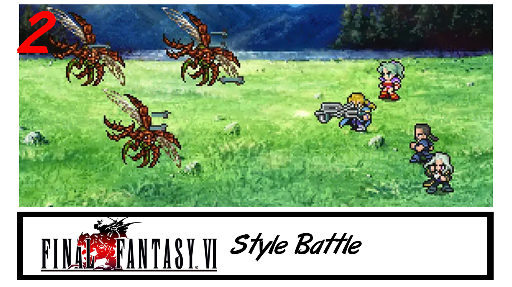

### Style 3 - Pokemon
As one of the biggest franchises on the planet, the original Pokemon games have captivated many people over the years, featuring two characters facing off on opposite corners, both with a 3/4 perspective sprite, with the player character facing away from the camera.

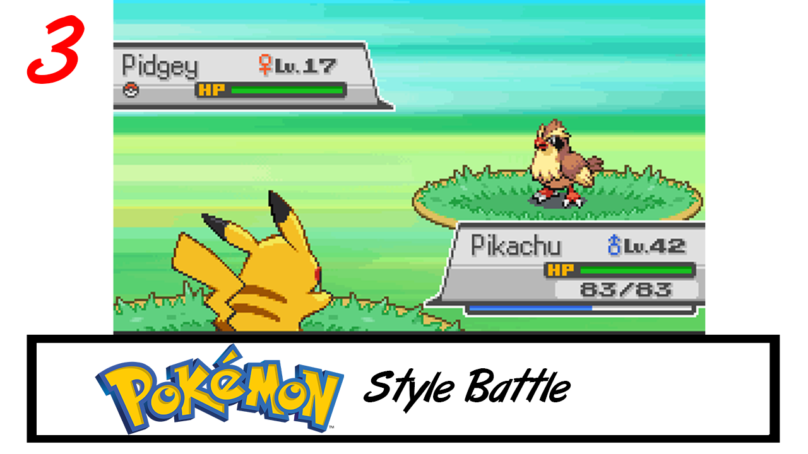

### Style 4 - Ace Attorney Investigations
While not an RPG series, the Ace Attorney games are puzzle games, where the main "combat" encounters take place with a courtroom, featuring the attorney and prosecutor in a battle of wits, in the mainline games these characters take up a full screen to themselves. However, the spinoff Ace Attorney Investigations features the two characters on one screen, duking with their words. Considering the dynamic experessions and how it requires you to "talk to fight", I thought this would be a good fit for the style of game we are making.

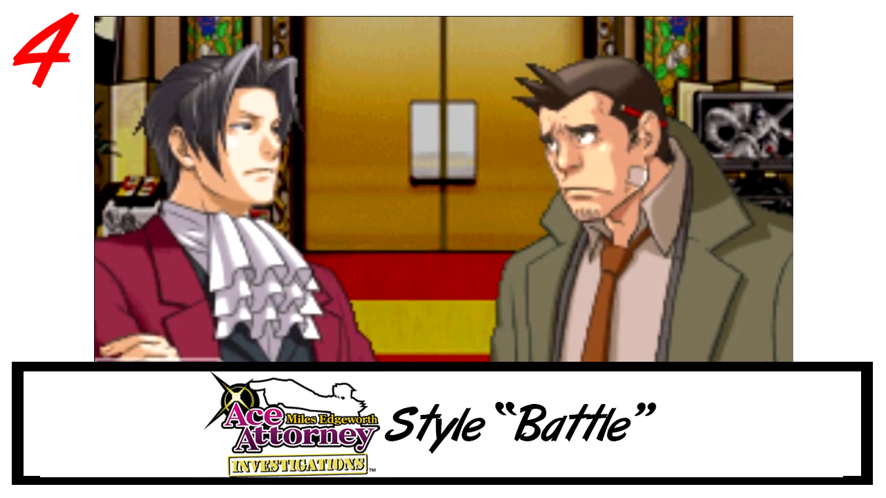

### Style 5 - Fear and Hunger
As a relatively unknown RPGMaker Horror game, Fear and Hunger features gruelling and cruel combat encounters, many of which encounters you can talk to the enemy to try and distract them, find out information or damage their mind by answering their questions. This game features front on enemies, similar to Undertale, while the player characters you see from the back in 3/4 perspective, like with Pokemon.

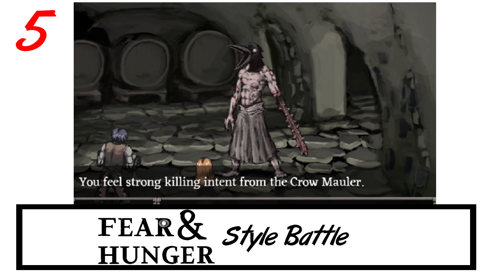

### Style 6 - Mario and Luigi RPGs
One of Nintendos greatest RPG series starting the Mario Brothers. The battle style in these games involves the player having an action command wheel, where the player can choose and action for combat. Combat involves timing button imputs to do damge, which special moves dealing more damage, but being harder to execute. The better your timing is, the more damage! Enemies attacks can also be dodged through timing button presses. This combat system is very engaging, as you not only have to strategies, but also be skilled enough to perform the action you choose.

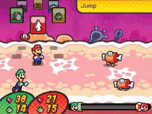

### Style 7 - Paper Mario The Thousand Year Door 
Another Nintendo owned RPG, this one staring Paper Mario. The battle system is very similar to the Mario and Luigi RPGs, with an action command wheel and being able to deal extra damage to enemies through timed button presses. However, enemey attacks can not be dodged through button presses, but rather force the player to take damage. Damge can be reduced through "blocking", by pressing the action command (usually the A button). The astetic of the action wheel is different to the Mario and Luigi RPGs, in that it aims to look more 2D, keeping with its paper aesthetic.

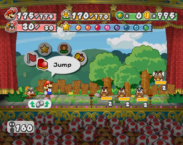

## Menu Style
Next up we need to consider how the player will respond to the enemy's questions.
### Menu 1 - List
This is arguably the most popular style of menu in RPG games, having a scrollable list for players to search through for their answer, relativly simple to implement and does what it needs to.
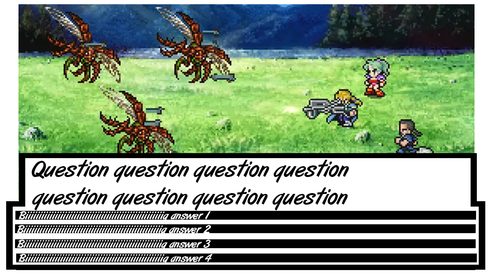
### Menu 2 - Square 
Having a square menu style with 4 options is definitely less popular in the genre, but still features in the monolithic franchise Pokemon, and given our Q&A combat having 4 answers, this style may work quite well, being slightly more difficult to implement however.
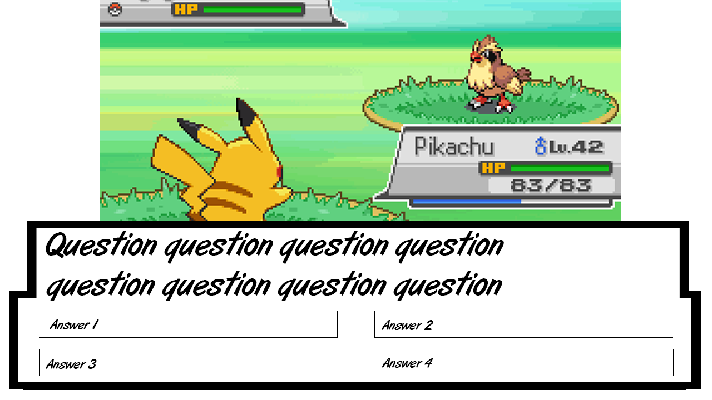

## Main Character Design
Next up we need to decide on a design for our main character, given we have already decided on our setting to be "IBM employee transported to another world" we already have restrictions in place, however there are still a number of decisions to make on main character design, such as:

- Body Type
- Race
- Age
- Clothing
  - Suit
  - Hoodie
  - Trousers
  - Shoes
- Hair
  - Colour
  - Style
  - Facial Hair

Main characters in RPGs vary wildly depending on setting, thus I think the best way to come up with our main character is to brainstorm rather than look at existing examples of main characters.

## Sprite Sheet
Once the main character's design is decided upon, we can start making our custom sprite sheet, which will contain all of the animations for world traversal.

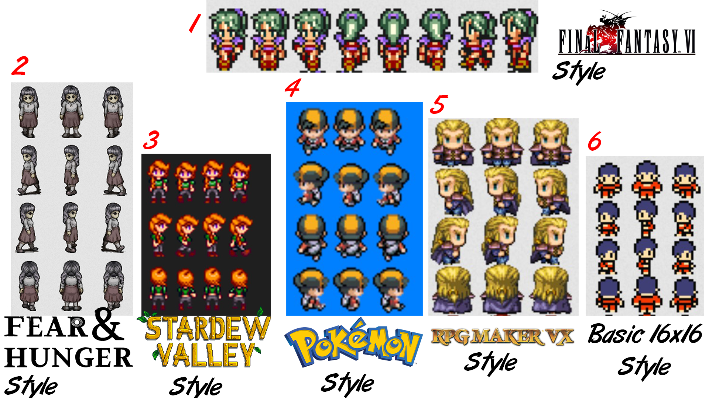

One of the biggest things to consider with sprite sheets is the amount of space they take up relative to the world around them, traditional RPG style has the world split into "tiles", which can be thought of like a square grid, in which the characters normally move between these tiles, and normally mean that sprites have to fit into that square area. However newer top-down 2d games are less restrictive, and have more free movement, which also means that character sprites do not have to conform to set tile space

The sprites I am showing off in this section are all walking animation sprites, with a step-stand-step style of animation, which is simple to animate, but works brilliantly, and is still used in modern top down games today

### Sprite Sheet 1 - Final Fantasy 6
Final Fantasy 6 sprites differ from the rest as they only have 2 frames on their sideways walk, they are slightly taller than a single tile, but would work for a tile-based game, and are relatively simple. And considering the person doing the art for our group does not have a great deal of experience, simple sprites are probably better.
### Sprite Sheet 2 - Fear and Hunger
Fear and Hunger sprites are 2 tiles tall, this means that while their hitbox is in their lower half, they also have an upper half, which lets them appear much more human and realistic. These sprites are much more complicated, but look amazing because of it.

### Sprite Sheet 3 - Stardew Valley
Stardew Valley's sprites do not conform to the tile system, but character designs are still simple, yet appear move humanlike by not conforming to tiles.

### Sprite Sheet 4 - Pokemon
Pokemon games are the classic representation of tile-based sprite sheets, and while simple and stylised, they also carry alot of detail.

### Sprite Sheet 5 - RPGMaker
RPGMaker is a game engine inspired by classic RPG games, and thus operate off a tile system, with their example sprites all fitting into one tile.

### Sprite Sheet 6 - Simple Style
Finally, we have the super simple 16x16 sprites, which conform to tiles, but lack a lot of detail.

### Sprite Sheet 7 - Faith: Unholy Trinity
Faith: Unholy Trinity sprites were purposfully created to be as simple as possible to emulate old 90s game sprites, thus they use limited colours and no shading, but are visable enough to make out what the sprites are.

### Sprite Sheet 8 - Party Hard
Party Hard Sprites are similar to the Faith sprites, in that they are very minimalistic, but express enough detail to be identifiable.

### Sprite Sheet 9 - Mario and Luigi Superstar Saga
The Mario and Luigi sprites are iconic for the Game Boy Advanced era. As the hardware was not very bright due to the screens limitations, the work around to make the characters seem more eye-catching and visible was to give them a thick black outline. This made the characters pop out more from the background scenery and became a staple for the series even after the hardware limitations were fixed. 

## Health
Our current idea for battles is to have it so that answering a certain number of questions correctly defeats the enemy, but answering incorrectly enough times will mean you lose the game. In this case we need a way to keep track of the number of questions, and the most traditional way to do this is through a health system.

There are two main ways to display health in video games, and we need to decide which is best for our game.
### Health Bars
A health bar is quite simply a bar to display health, normally analogue in nature.
Take this screenshot from Guilty Gear Xrd, a fighting game released in 2014. At the top of the screen there are two health bars to represent each character's health.

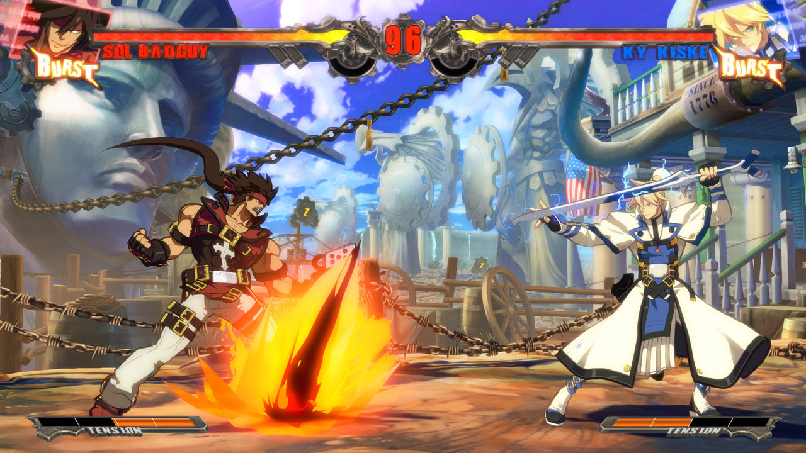

As this health bar depletes it will "empty" towards the centre of the screen.

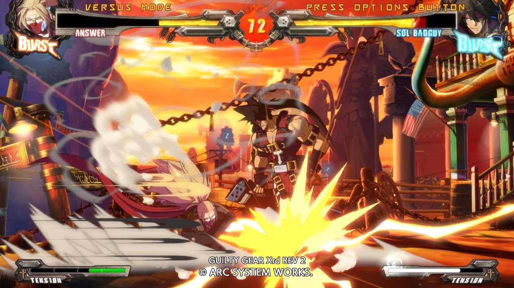

Or take this screenshot from Trails from Zero, an RPG originally released in 2010, which features 4 "party members" each of which having 3 bars, "Health Points", "Energy Points" and "Craft Points", each of which deplete towards the left as you use them or are damaged. In addition, if you bring your Craft Points over 100, there is another bar, in a lighter colour of green, that overlaps the original bar, which is commonly used in games to represent a strong character having multiple health bars.

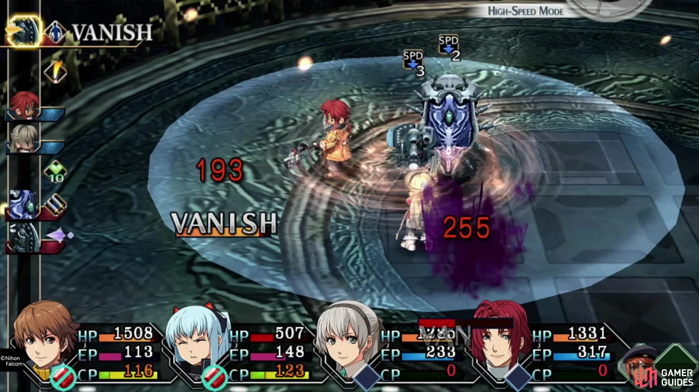

The advantages of health bars is that they simple and easy to look at, as they can be represented numerically, and can be manipulated freely

### Heart Bars

Heart bars are a more discrete representation of health bars, as instead of having a large number to represent health, you instead have a more constant smaller numerical representation, and each piece of damage would represent one "heart".

In Minecraft you have 10 hearts, where each piece of damage counts for a quarter of a heart, thus giving a visual representation of 40 hit points.

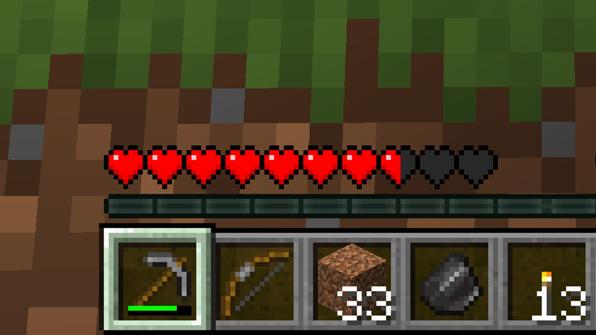

In addition, if you have the "absorption" effect, you get bonus hearts, which overlay the regular hearts, represented by their yellow colour.

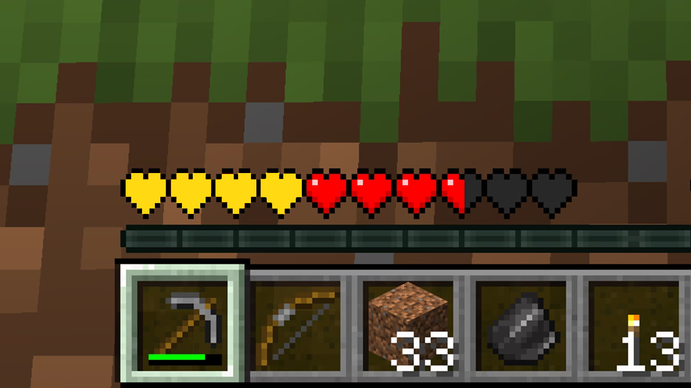

The positives of heart bars are they also allow you to represent health in unique ways, for example in hollow knight, each piece of health is represented by a "mask", thus this concept allows for more creativity, as we can represent health as whichever item we desire, however this would require a lot more programming and asset creation.

# Finalization of Ideas based on Market Research

## Combat
The combat will be modeled after Phoenix Wright Ace Attorney, with 2 big sprites of the characters on each side.

## Menu
The Menu will be a Final Fantasy style with 5 (or more) possible answers

## Character Sprites
The character sprites will be modeled after the pokemon character sprites.

## Health
The health bar will a be heart based system modeled after the Hollow Knight health system.