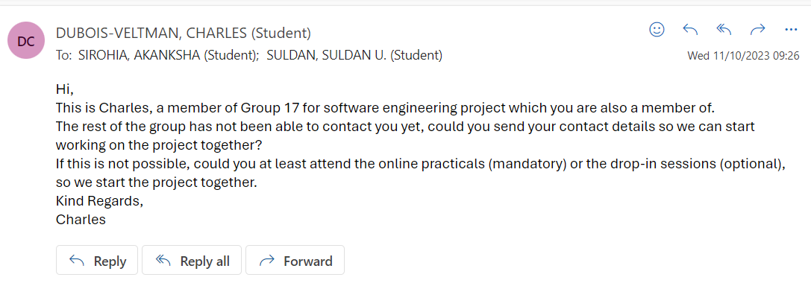
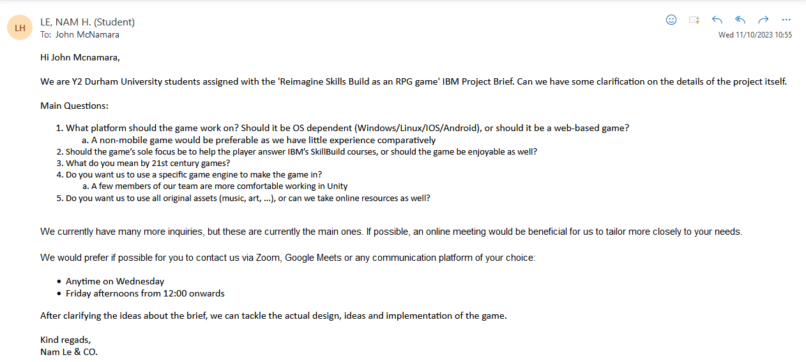
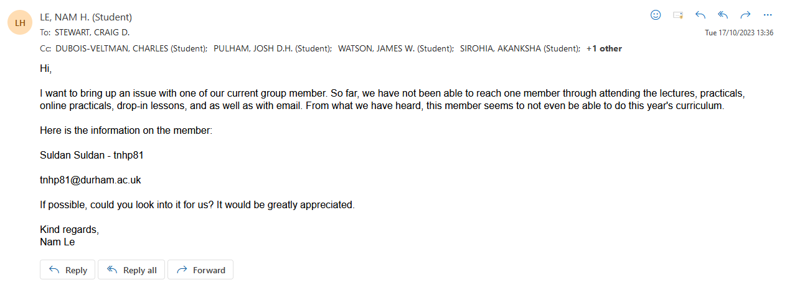
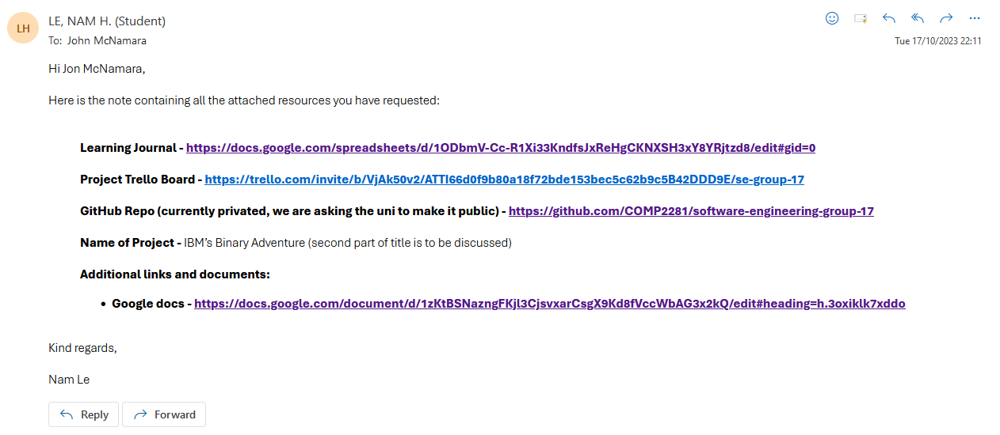

# Overview

## Proposed Titles

- IBM's Binary Adventure
- That time I was transported to a digital world and became the best IBM Skill Build user
- Ascending the IBM tower of Skill Build mastery
- IBM's blessing on this wonderful digital world
- How to pick up badges in a digital world

## Questions to ask client

1. ~~What platform should the game work on? (OS dependent? Windows/Linux/IOS/Android/Web-based?)~~
2. ~~How in-depth should the resources linked in the game go into? (If an end user can get the badges in the IBM courses, should they be made to play the game fully, or can they answer the question and quickly get through it?) - Should the game’s sole focus be to help the player answer IBM’s SkillBuild courses, or should the game be enjoyable as well?~~
   - ~~We should totally make a resource system where things are limited, forcing the player to make choices~~
3. What controls should the game use? (Touch input? Controller support? Keyboard?)
4. ~~What is the age range of our target audience?~~
5. Should the game only be for people with no knowledge of IBM skills?
6. Should the game be aimed at people with little or lots of knowledge of RPGs?
7. ~~What do you mean by 21st century games?~~
8. ~~Do you want us to use a specific game engine to make the game in?~~
   - ~~Say we prefer Unity or RPGMaker~~
9.  ~~Do you want us to use all original assets, or can we take online resources as well?~~
   - ~~Royalty free?~~
10. What system requirements are recommended for the game to run on?
11. ~~Genre?~~
12. ~~Art style?~~
13. ~~Clarify what specific skills build sections we should be going over~~
14. ~~Should the game be an aid to the course or a course replacement?~~
15. ~~Can we add John into the game?~~
16. Where to find the documentation?

#### Answers to questions
1. Windows
2. Resources can be accessed directly on SkillBuild, and thus will not need to be implemented in the game. Only the questions needs to be in. The game ideally should be fun and help learn.
   - Idea scrapped   
3. N/A
4. Secondary school and University students
5. N/A
6. N/A
7. Something fun and engaging
8. Unity if we have a license for it
9. Online resources are fine as long as they are free
10. N/A
11. RPG, any genre is fine
12. Any art style is fine
13. Capstone is recommended. Aside from that, any green coloured courses on RAG sheet
14. Aid to course
15. Yes
16. N/A

## SOP - RAG Sheet 

1. Go through pathway to learning, review all the checkmarked skills and add the relevant ones to the RAG spreadsheet
   1. Green - project
   2. Amber - course / career
   3. Red - not relevant
2. Review a Skills Build learning activity that is green on the RAG sheet, get the badge for it and add the following to learning journal
   1. Week of the project
   2. Title of learning skill reviewed
   3. A link to the page
   4. A paragraph about what you learnt

## Overview of what needs to be done for the game:
1. Main menu
    -  New game
    - Continue
    - Settings
    - Controls
    - Credits
    - Exit
2. Pause Menu
    - Continue
    - Controls
    - Exit
3. Intro cutscene with john
    - Character selection
4. Cutscene where you get sucked into the computer
5. Hub World
6. Creation of other worlds with specific puzzles
7. Interactable objects for documentation
8. Combat system 
9. Skill tree
10. Item collection / inventory
11. Final Boss
12. Final cutscene

## Communication

#### What we learnt from Online Meeting (18/10/2023):

- Age group: Secondary, Uni
- Not violent / inappropriate
- Game which allows pause
- Puzzle / Q&A
- CAPSTONE badges should be used for questions
- Needs to have saving feature
- Sprite of John needs to be in the game

#### [Learning Journal](https://docs.google.com/spreadsheets/d/1IZtANq7ruhhZvN3znZopCmB7hLXw76JRNAhnZD1jfeE/edit?usp=sharing)